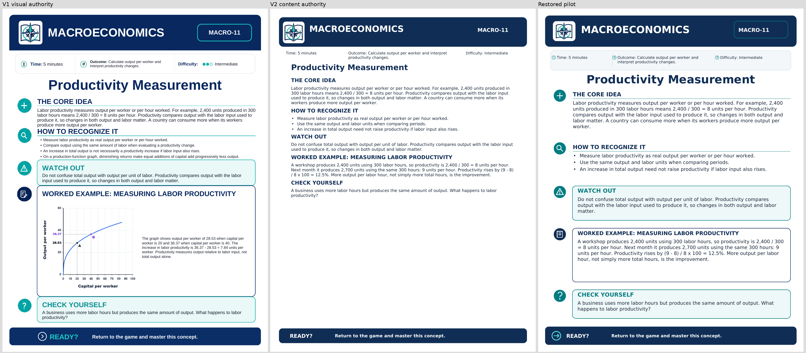
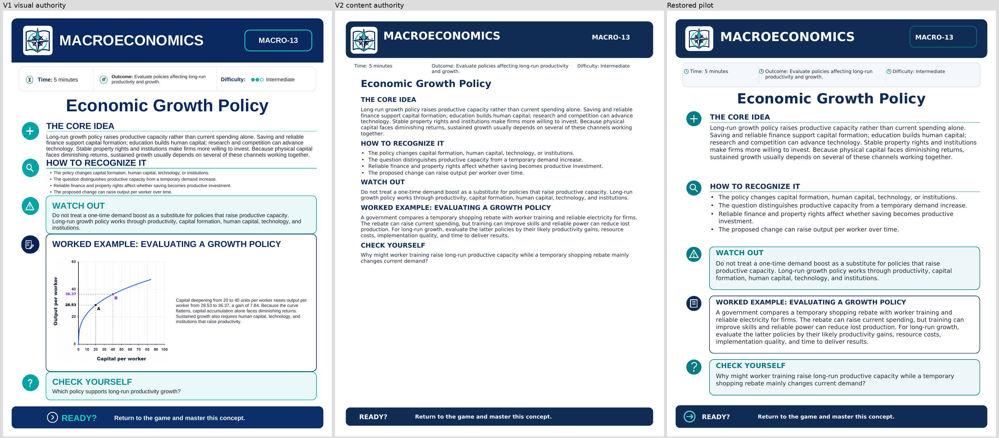

# Concept Review visual style restoration

## Task Identity
CONCEPT_REVIEW_STYLE_RESTORATION_V1

## Repository
Verified working directory and Git top-level: C:\Users\Jennings\Documents\GitHub\masteryquests-website.
Branch: main. Baseline HEAD: 064362140bb6439d044f1c2aa835d841783f75ae. Preflight status clean; write probe passed. Forbidden workspace unused. No reset, commit or push. Unrelated systems remain unchanged.

## Problem
Owner-QA content corrections were approved, but qa_renderer.py drew changed sheets as plain text sections under a simple header. It omitted the established cards, icon rail, teal rules and balanced composition. Short resources such as MACRO-11 and MACRO-13 left excessive unused space.

## Authorities
V1 = visual authority: validation_artifacts/concept_review_owner_review/v1/.
V2 = corrected-content authority: validation_artifacts/concept_review_owner_review/v2/.
Read FINAL_REPORT_concept_review_owner_qa.md and FINAL_REPORT_concept_review_qa_remediation.md. The maintained concept_review_source.json remains byte-identical to the v2 baseline. accessibility_semantics.json remains the sole semantics system.

## Scope
80 remediated resources reviewed and restored; 71 current candidates reused without regeneration. Exact IDs and layout modes are in [STYLE_RESTORATION_SUMMARY.md](validation_artifacts/concept_review_owner_review/v3/STYLE_RESTORATION_SUMMARY.md). Scope came from the prior remediation dispositions, not timestamps or folder ordering.

## Root Cause
The remediation renderer introduced a separate plain vertical flow rather than using the established visual components. It preserved semantic content but had no styled Watch Out, Worked Example or Check Yourself cards and no page-balance constraint. This was a renderer/template regression, not a content-source defect.

## Pilot
Restored: MACRO-11, MACRO-13, MACRO-16, MACRO-20, GEN-ECON-09, MICRO-52, MICRO-51. MICRO-49 served as the eighth, unchanged payoff-table control because it belongs to the protected 71. Pilot coverage included graph removals, calculation/policy text, a new labor graph, replacement kinked-demand graph, two semantic tables and the sequential game.

V1/v2/restored renders were inspected side by side in [pilot comparisons](validation_artifacts/pdf_accessibility/style_restoration_v1/pilot_comparisons). All seven rebuilt candidates passed exact v2 text comparison, explicit PDF/UA-1, semantic checks and deterministic rebuild. Visual refinements fixed table-to-prose spacing and metadata marker placement before batching. Pilot decision: PROCEED. Human owner approval was not claimed.

## Renderer Restoration
Added shared qa_template.py with centralized frame, margins, colors, rounded panels, title hierarchy, vector icons, metadata strip, footer and content-fit measurements. qa_renderer.py dispatches the 80 styleRestoration records to this template. The legacy branch remains for historical rendering; unaffected resources retain their existing routes. Table painting uses navy headers, light row-header fills, restrained rules and emphasized totals.

No manual finished-PDF patches. Current maintained source and semantics regenerate the restored design deterministically. Per-batch checkpoints record source files, resource IDs, hashes, validation and blockers.

## MACRO-11
V1 supplied the metadata card, icon rail, rounded panels and page composition. V2 supplied the frozen productivity example: 2,400/300=8, then 2,700/300=9 and a 12.5% gain. The restored worked panel uses this calculation text; the removed production-function graph remains absent.

## MACRO-13
The restored policy card preserves v2's comparison of a temporary rebate with worker training and reliable electricity. It restores the visual grouping and page balance without restoring the redundant production-function graph.

## Graph Layouts
All approved new/replacement graphs remain: MICRO-68, MACRO-16, GEN-ECON-16, GEN-ECON-22, MICRO-14, MICRO-24, MICRO-27, MICRO-52, MACRO-30 and MACRO-38. Their pixels and alternatives remain unchanged. Wide corrected graphs occupy the worked card above explanation; retained taller figures use graph/text columns. No removed graph was reinstated.

## Table Layouts
All 22 genuine tables remain, plus the unchanged MICRO-49 table. Navy headers, restrained separators and meaningful total-row emphasis integrate them into the worksheet family. MACRO-20 retains every bank value and both accounting identities. Table/TR/TH/TD, Scope, IDs, Headers associations, navigation and source cell mappings remain intact. Existing source-generated visible cells were restyled; tables were not replaced with Figure images.

## Text / Calculation Layouts
Text-only and calculation examples use fitted worked cards and measured vertical spacing rather than empty graph placeholders. Layout counts: {'text / calculation': 24, 'graph + text': 34, 'full-width table': 22}. Body sizes used: [8.5, 9.0, 9.25, 9.5, 9.75, 10.0, 10.25, 10.5, 10.75, 11] points. Dense pages use the compact setting, with a floor of 8.5 points; short pages use larger text. Table text is at least 9.18 points. This accommodates frozen content while remaining within the established worksheet family's typography.

## Template Fidelity
Restored branded navy header/resource card, divided metadata card, centered navy title, circular section icons, teal section rules, rounded pale Watch Out, bordered Worked Example, pale Check Yourself and branded Ready footer. Page dimensions remain 612 by 792 points and one page. All final renders were inspected. No clipping, overflow, missing panel or large unexplained lower-page void remains. The Check Yourself panel ends at y=77, leaving a 19-point footer gap.

## Content Preservation
Complete canonical source SHA-256: b3bae4b70f5866693464820196f4bda6952cec8453be2878605121b77c7710dc. It matches the frozen v2 baseline exactly. All 80 regenerated visual sources have the same normalized extracted-text hashes as v2. Only style-dependent semantics fields changed: style selection, table painting fingerprints and decorative-image inventory. Formula selectors/alternatives, Figure alternatives, table values/header associations and source ordering are unchanged. No approved economics correction was reverted and no new instructional wording was introduced.

MICRO-49 remains B/Y=(1,1), strictly dominant A/X and unique (A,X). MICRO-07 complements, MICRO-14 consumer surplus, MICRO-16 exports, MICRO-22 AFC, MICRO-32 point B, MICRO-48 upper bound, MICRO-51 backward induction, MICRO-52 MR gap, MACRO-11/13 examples, MACRO-16 labor graph, MACRO-20 table, MACRO-38 endpoint and all medium/low corrections remain protected by the unchanged source and regressions.

## Accessibility Validation
80/80 restored candidates independently pass explicit veraPDF PDF/UA-1 and project validation. Preserved PDF 1.7, language/title, headings, paragraphs, lists, Formula runs, Figure alternatives, semantic tables, embedded fonts, content associations and logical order. Navy/teal/body text contrast and retained graph line distinctions remain. Raw validator reports and per-resource results are linked from [final_validation.json](validation_artifacts/pdf_accessibility/style_restoration_v1/final_validation.json).

## Determinism
80/80 restored candidates match independent rebuild SHA-256 values. 71/71 reused candidate/rebuild hashes remain valid. Candidate and rebuild paths/hashes are recorded in final_validation.json and the batch checkpoints. No unaffected resource was rebuilt.

## Visual / Style Review
80/80 PASS in Codex render review and deterministic component/balance checks. Checks examine actual rendered fills, borders and icons as well as component placement and bottom-page use. Negative probes reject missing panels, fills, borders, icons and blank renders. These checks flag obvious regressions; they do not replace owner aesthetic judgment.

## Full Staged Gate
**151 / 151 ACCEPTED**

- PDF/UA machine: 151/151
- Semantic/project: 151/151
- Content/authorized-difference: 151/151
- Determinism: 151/151
- Contrast/visual: 151/151
- Style/template review: 80/80 restored resources

[Gate evidence](validation_artifacts/pdf_accessibility/style_restoration_v1/staged_gate.json). Source, semantic, candidate, raw validator and preservation/determinism evidence for all 71 reused resources were rechecked. Gates were not weakened.

## Regression
40/40 instructional, semantic-table and template tests pass (10 MICRO-49, 16 QA, 8 table, 6 template). Accessibility negative probes: 27/27 detected. Pipeline: 19/19. Current Composer/integration suite: 27/27 PASS, including Concept Review integration, Mastery Report routing/state and package/resource tests. Logs are under validation_artifacts/pdf_accessibility/style_restoration_v1/.

## V3 Review Package
C:\Users\Jennings\Documents\GitHub\masteryquests-website\validation_artifacts\concept_review_owner_review\v3

151 PDFs: 26 GEN-ECON, 68 MICRO, 57 MACRO. 151/151 hashes equal selected staged candidates. Includes README, checklist, summary, manifest, changelog, style summary and local index. Historical findings and v2 dispositions retained; owner approval fields blank. No external dependency, network call or telemetry in the index.

## Installation Preview
Prepared — NOT executed. validation_artifacts/pdf_accessibility/style_restoration_v1/installation_preview.json plans 151 logical resources and 302 destination copies. The 15 missing public MICRO-54 through MICRO-68 files remain uncreated. No active manifest checksums changed.

## Active Production State
Production remains unchanged. All 974 protected-file hashes match, including active PDFs/manifests, prior staged evidence, the entire v1/v2 review packages and canonical instructional source. No installation, deployment, commit or push. The pipeline test exercised only isolated scratch fixtures.

## Human AT Verification
PENDING. Refreshed representative copies are in validation_artifacts/pdf_accessibility/owner_test_pack/style_restoration_v1. Covers tables, graphs, removed-graph layout, formulas and MICRO-49/MACRO-16/MACRO-20. No human screen-reader or PDF-reader verification is claimed. Owner visual approval remains required before separately authorized installation.

## Remaining Issues
No unresolved implementation or validation blocker. Owner visual approval and human AT are pending review steps.

## Final Status
VISUAL STYLE RESTORATION COMPLETE — V3 OWNER REVIEW PACKAGE READY
