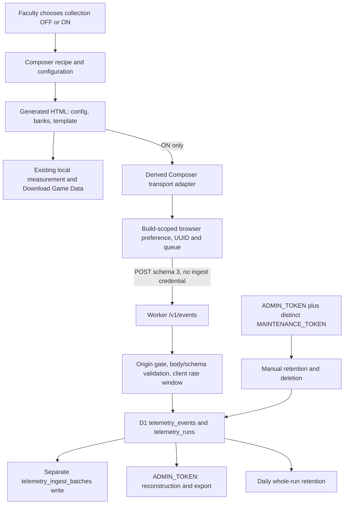
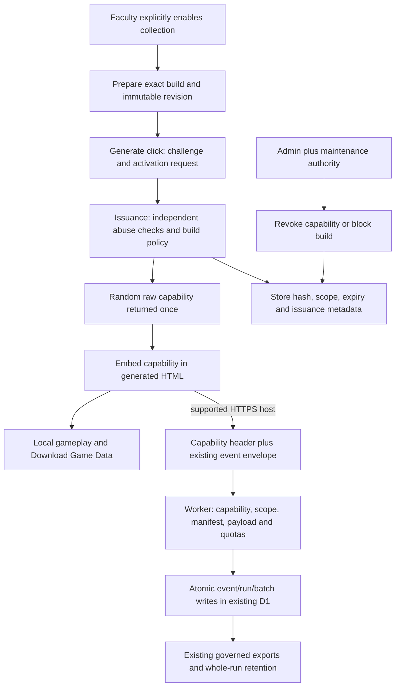

# Portable telemetry capability architecture audit

Audit date: 14 September 2026. Repository: `C:\Users\Jennings\Documents\GitHub\masteryquests-website`.

**GO for a separate, staged implementation of the design below. NO-GO for immediate public activation or deployment.** This is an architecture and planning deliverable. No capability feature, production source/configuration change, database migration, deployment, commit, or push was performed. SQL below is a proposal, not an installed migration.

The recommended design uses an inspectable, opaque, 256-bit capability that authorizes only anonymous ingestion for an exact build identity. It cannot establish that events came from an authentic game, a faculty member, or a human student. A copied capability permits fabricated events within its scope. Expiry, revocation, shared build quotas, independent issuance controls, and atomic database enforcement contain that risk; they do not eliminate it.

Three findings materially shape implementation:

1. **A run manifest is not a fixed build manifest.** Existing `manifestID` changes with mode and runtime parameters. Bind the capability to existing `buildId`, `gameId`, `buildVersion` (the immutable measurement build revision), and schema 3; validate run manifests against that revision. Do not invent a single immutable run `manifest_id` at activation.
2. **Authorization must cover database ownership and concurrency.** Current event IDs and run IDs are global, and a pre-read followed by `INSERT OR IGNORE` plus unconditional run upsert can overcount under concurrency. Adding a token lookup alone would leave cross-build run contamination and write races unresolved.
3. **The public-game boundary has an existing exception.** National Engine still contains a separate legacy identifying transport. This audit preserves all public games and proposes no capability for any of them. It cannot truthfully certify that every existing public game already makes zero remote telemetry requests. That separate release/privacy issue needs an owner decision; it is not a reason to enable any new remote collection.

## 1. Baseline, evidence, and limits of this audit

Commands were executed in the authoritative repository:

```text
git status --short
<empty: clean working tree>
git branch --show-current
main
git rev-parse HEAD
070019ca57c72e503498184b4c201ad9ddef7ca4
```

No applicable `AGENTS.md` was found in the repository, including hidden paths, or the checked parent directories. Only the requested report and `validation_artifacts/portable_telemetry_capability_design/design.json` are audit outputs. Existing source, generated games, dist, historical evidence, exports, and local/remote databases were left untouched.

Evidence labels used here:

- **Source:** direct inspection at the HEAD above; file and function/line references below.
- **Local probe:** execution of existing code in memory, with no production traffic or database binding.
- **Supplied production fact:** the user's verified Composer → hosted HTML → Worker HTTP 202 → D1 result. This audit accepts that result and does not repeat it.
- **Provider documentation:** official documentation checked on the audit date. These facts do not establish the actual account's entitlements, deployed configuration, logging, or capacity.
- **Proposal:** future behavior requiring implementation and validation. The test matrix is not a list of completed feature tests.

Repository configuration identifies Worker `masteryquests-anonymous-telemetry-poc`, route `masteryquests.org/api/anonymous-telemetry-poc/*`, binding `TELEMETRY_DB`, and database `managerial-telemetry-poc`, UUID `16b248ff-20cb-429c-a4a1-dd50d17c1fd0`. These match the supplied production context. No remote account, secret, D1 row, or deployed version was queried.

Read-only generation checks passed:

```text
node audit_tools/telemetry_governance/composer-transport.mjs --check
PASS: Composer anonymous adapter synchronized.
node audit_tools/telemetry_contract/generate.mjs --check
PASS: deterministic artifact registry and embedded contract helpers.
```

A local probe called the actual Worker with no D1 binding to distinguish origin rejection (403) from reaching ingest (503). Another probe evaluated only extracted configuration/pool declarations from the existing beta HTML and the maintained measurement helper; it did not boot or play the game. Both probes ran entirely in memory.

## 2. Locked contracts and scope

Keep `mq-measurement/1`, `mq-governance/2`, `mq-disclosure/2`, anonymous envelope schema 3, 730-day operational whole-run retention, and cron `17 4 * * *`. Capability lifetime is a separate admission control. No field is removed or redefined; legacy envelope 1/2 support is isolated to existing legacy ingestion during transition.

Keep `ADMIN_TOKEN` for administration/read/export and the additional distinct `MAINTENANCE_TOKEN` for manual maintenance. Neither is an ingest credential. New Turnstile and infrastructure-abuse secrets, if used, are separate Worker secrets with no administrative authority and are never embedded in HTML.

Faculty/build collection defaults OFF and requires strict explicit `true`. Browser choices can further disable transmission and cannot enable an OFF build. Student Download Game Data stays local and independent. Gameplay, local records, and downloads continue through activation or network failure. Operational telemetry is not research by default; exports and separately designated research retain their existing custody rules.

No faculty accounts, faculty identifiers, names, email addresses, LMS/university account identifiers, or free-text responses are added to application telemetry. Existing behavioral interaction fields remain contextual signals, without automated misconduct scores. Deleting application data does not erase downloaded copies, provider logs, or backups.

The proposal does not require changing a locked policy. If implementation requires a new identity system, different retention, changed measurement semantics, or new identifying telemetry, stop that implementation and return to the owner; this audit does not authorize those changes.

## 3. Current architecture and source map



Paths below are relative to the authoritative repository solely to keep the inventory readable; line references are one-based at the audited HEAD. C = canonical source; G = generated/derived output; H = historical or released artifact.

| # | Current responsibility | Exact source path and entry point | Status and observed behavior |
|---|---|---|---|
| 1 | Composer ON/OFF | `build/faculty-build-composer/composer.js:208,1210,1881,1926`; `index.html:35`; `composer-core.js:1524,2094` | C. State false; strict boolean through recipe creation/import/migration/config. Checkbox changes state and recalculates readiness. |
| 2 | Build preparation | `build/faculty-build-composer/composer.js:1671` `prepareGeneratedGame()` | C. Snapshot recipe → compose → validate reviews/answers → create config → embed artwork/graphs → `Core.buildHtml()`. |
| 3 | build_id | `audit_tools/telemetry_governance/composer-transport.mjs:6` transformation of private adapter constant | C generator. Composer value `composer-` + full 64-hex `compositionFingerprint`. G adapter: `build/faculty-build-composer/anonymous-telemetry-source.js:2` (encoded source string). |
| 4 | build_version | `play/managerial-directorate-telemetry-poc/telemetry-client.js:739`; `audit_tools/telemetry_contract/runtime.js:37` `build()` | C transport uses `MQContract.build().buildRevision`. It does not transmit the retained human `BUILD_VERSION` constant. |
| 5 | game_id | `audit_tools/telemetry_governance/composer-transport.mjs` replacement of script/dataset lookup | C generator sets `faculty-composer`. Private source otherwise uses script dataset/document data, default `managerial-hub`. |
| 6 | Composition fingerprint | `build/faculty-build-composer/composer-core.js:2089,2115` `canonicalRecipe()` / `createConfig()` | C. SHA-256 of stable canonical recipe, including collection choice, title/slug, selected configuration, appearance, library/template labels. This is not a hash of final HTML bytes. |
| 7 | Measurement manifest | `audit_tools/telemetry_contract/runtime.js:26,37,67` `config()`, `build()`, `stamp()`; `server/anonymous-telemetry-poc/measurement-contract.mjs:10` | C. Build hashes analytical config, pools and release provenance. Run manifest adds mode and runtime parameters; `manifestID = hash(manifest)`. Stored inside existing `extras_json`. |
| 8 | Adapter embedding | `build/faculty-build-composer/composer-core.js:2067` `buildHtml()` | C. Inserts maintained source before `</body>` only when strict build ON. Missing adapter source throws. Template already contains local measurement helper. |
| 9 | Endpoint | `audit_tools/telemetry_governance/composer-transport.mjs`; private adapter `:42–47` | Composer G source fixes `https://masteryquests.org/api/anonymous-telemetry-poc/v1/events`. Private POC has query/meta QA override; classroom derivation removes override. No future capability may follow an arbitrary endpoint override. |
| 10 | Browser preferences | Private adapter `:12–32,523–532` `remoteEnabled()`, `setRemoteCollection()`; inherited by Composer | C with generated measurement block. Build permission checked first; scoped `remoteDisabled:v1`: `0` allows, `1` denies, malformed denies. Old restrictive opt-out inherited only if current preference absent. Storage failure denies. |
| 11 | anonymousClientId | Private adapter `:523–526,574` `BUILD_SCOPE`, `getClientId()` | Random UUID stored per origin/browser and logical build. Composer scope hashes `[compositionFingerprint, buildRevision]`; no cross-origin identity bridge. Identical build at different hosts gets separate browser storage. |
| 12 | Queue/storage | Private adapter `:523–563,707–794` `emit()`, `persistQueue()`; initialization near file end | Queue, run mapping, sequence, quality and opt-out share v2 build namespace. Maximum 2,000 queued events; prioritizes retaining referenced manifests during overflow. Invalid current queue fails closed; old family UUID/queue is not imported. |
| 13 | remoteEnabled hierarchy | Private adapter `:12`; Composer overrides `IS_COMPOSER` | Memory disable or invalid build scope → false; strict faculty/build permission → restrictive browser setting → permission. Existing logic has no capability/expiry check. |
| 14 | Event batching | Private adapter `:1051` `scheduleFlush()` / `flush()` | 25 records normally; 10-second abort; exponential retry capped at 30 seconds; `credentials: omit`; JSON and `x-telemetry-phase`; visibility/pagehide keepalive attempts. Acknowledgment IDs remove only sent records. 400/413/422 isolate poison records using singleton retry. |
| 15 | POST entry | `server/anonymous-telemetry-poc/worker.mjs:34,59` `route()` / `ingest()` | C. Optional route prefix; origin check; no ingest secret. 202 includes batch ID, accepted, duplicates and acknowledged event IDs. |
| 16 | CORS | Worker `:249–289` | C. Exact comma-split `ALLOWED_ORIGINS`; originless request bypass; OPTIONS handled before path routing; details in section 4. |
| 17 | Request validation | `server/anonymous-telemetry-poc/telemetry-core.mjs:73,91`; `measurement-contract.mjs` | C. 1–50 records; 128 KiB UTF-8 body ceiling; envelope/event phase; UUIDs; schemas 1/2/3; sequence 1..1e9; timestamp prior 90 days/future 10 minutes; identifier-key exclusion and bounded allowlists; schema 3 requires contract ID. |
| 18 | Rate limiting | Worker `:154`; `transport-safety.mjs:7`; Wrangler var | C. 300 submitted events per client UUID per minute, duplicates included. Separate SELECT/UPSERT, not atomic. Invalid limit config safely falls back to 300, allowed configured range 50..10,000. No current application-wide or IP limiter in this Worker. |
| 19 | Event insertion | Worker `:70–107,109`; migration `0001_initial.sql` | C. Pre-read event IDs and `(run_id, sequence_number)`; filter duplicates; `INSERT OR IGNORE` 38 columns. UUID event primary key and run/sequence unique index. Parameterized SQL. |
| 20 | Run aggregation | Worker `:132` `runUpsert()` | C. Global run UUID primary key; increments count, maximum sequence, latest client/receipt time, completion only for `run_completed`, mixed-synthetic MIN. No immutable run/client/build ownership assertion. |
| 21 | Batch tracking | Worker `:96–102`; migration `0001_initial.sql` | C. Separate post-insert D1 write records counts, client UUID, synthetic, receipt. No build or capability linkage today. Batch failure can follow committed events. |
| 22 | Admin reconstruction | Worker `:217` run route; `telemetry-core.mjs:238` `reconstructRun()`; `tools/reconstruct-run.mjs` | C. ADMIN_TOKEN; sequence-ordered rows, accepted-attempt metrics, lifecycle/manifest/anomaly reconstruction. Offline tool reads an existing local export. |
| 23 | Admin export | Worker `:226` `/v1/admin/export.csv`, `csv()`; `audit_tools/telemetry_governance/admin.mjs` | C. ADMIN_TOKEN; build filter, synthetic excluded by default, 50,000-row limit, policy headers and optional CLI governance sidecar. Spreadsheet string protection in `transport-safety.mjs`. No capability should add export authority or change CSV columns. |
| 24 | Retention/maintenance | `governance-policy.mjs:2`; `governance.mjs:4`; `scheduled-retention.mjs:4`; Worker `:263` | C. 730 days from latest stored server receipt; whole-run eligibility re-evaluated in deletion batch; daily 04:17 UTC. HTTP admin requires ADMIN_TOKEN; manual maintenance additionally distinct MAINTENANCE_TOKEN. Scheduled internal authority has no HTTP bypass. |

Additional derivation chain: `audit_tools/telemetry_contract/runtime.js` + `release.json` + source/assets → `generate.mjs` → `registry.json`, `hash.mjs`, embedded helper/registry in canonical template and private transport → `audit_tools/managerial_telemetry_parity/sync-composer-behavior.mjs` and `composer-transport.mjs` → Composer string adapter. `audit_tools/managerial_classroom/build.mjs` derives the classroom adapter and private builds; `audit_tools/published_managerial_parity/sync.mjs` maintains public local-only adapter output. These generators need coordinated checks, not hand edits to encoded source.

`beta-testing/composer-telemetry-live-test/index.html` is an existing released generated snapshot, not canonical source. `dist/` is publication output produced by `audit_tools/public_site_publication/build-dist.mjs`. That builder copies an explicit Composer file list and only the named beta file. Do not run it during this audit; it rewrites dist. Existing historical samples under Composer tests are not the implementation source.

Validation limitations: envelope-level unknown keys are currently ignored, event-level unknown fields reject; several legacy core types coerce while extras are more strictly typed. Event names are regex-valid rather than a closed semantic enum. A valid manifest hash proves internal consistency, not truthful content. A run manifest is not required on every event by the current validator; unresolved lifecycle records can carry null manifest IDs. Current server validation also does not recompute the base buildRevision from the manifest or bind event buildVersion to it.

## 4. Current CORS and origin behavior

`server/anonymous-telemetry-poc/wrangler.jsonc:25` declares only:

```text
https://masteryquests.org
https://www.masteryquests.org
```

`assertAllowedOrigin()` returns immediately for missing/empty Origin. A present nonmatching value throws 403. Thus Origin is both a browser response policy input and a weak application ingest gate, **not authentication or credible authorization**. A non-browser caller can omit it or supply an allowed string. No token is presently required for ingest.

| Request source / Origin header | Current OPTIONS | Current POST /v1/events |
|---|---|---|
| `https://masteryquests.org` | 204; exact ACAO echo | Passes origin gate; payload/rate/storage checks apply |
| `https://www.masteryquests.org` | Same | Same; request still targets apex API. Allowed www Origin does not create a www Worker route |
| GitHub Pages, e.g. `https://faculty.github.io` | 403; no ACAO | 403 |
| Another HTTPS origin | 403 | 403 |
| HTTP localhost | 403 under current production vars | 403 |
| `Origin: null` from file/sandbox | 403 | 403 |
| Absent Origin | 204; no CORS headers | Passes gate, no CORS response headers |
| Non-browser client | Header-dependent; CORS is not enforced by the client | Can omit/spoof Origin; remaining validation is the only ingest boundary |

Allowed responses set `Access-Control-Allow-Origin` to the exact Origin, `Vary: origin`, methods `POST,GET,OPTIONS`, and headers `content-type,x-telemetry-phase,authorization`. There is no allow-credentials header. OPTIONS runs before routing, even on unknown/admin paths, and does not verify requested method/header subsets; the browser checks those against the returned list. `x-telemetry-maintenance` is absent, and admin responses are not wrapped in CORS. The CLI is the supported administrative path.

Outer-catch exceptions bypass `withCors()`. Therefore allowed-origin malformed-event and thrown rate-limit errors may appear as network/CORS failures in an off-origin browser; explicit body-size/storage responses have CORS because they return through ingest. Correct this for the future ingest/activation routes without opening admin CORS.

The in-memory no-storage probe returned 204/503 for both allowed origins, 403/403 for GitHub-like, other HTTPS, localhost and null, and 204/503 for absent Origin. This verifies routing, not production delivery.

## 5. Target architecture and authority boundaries



Only possession of an active ingest capability plus matching validated payload grants new-write authority. No principal is logged in. A capability ID is an operator reference, never a second authentication option. An ingest credential cannot read, list, reconstruct, export, delete, perform maintenance, or serve as authority to issue or renew credentials. Activation remains separately gated by challenge, issuance quotas, and build policy; possession of a game is not eligibility proof.

Use `crypto.getRandomValues(new Uint8Array(32))`, encoded as exactly 43 canonical unpadded base64url characters with a version prefix `mqic1_`. Hash the canonical ASCII full token using SHA-256 and store 32-byte digest as 64 lowercase hex. Reject malformed length, prefix, alphabet, duplicate/comma-combined headers and noncanonical encoding before a lookup. Capability ID is a separate random UUID. Use the indexed hash for lookup, not the ID. Do not log either the raw token or its digest. Cloudflare Workers supports secure random bytes and SHA-256 through native Web Crypto; no Node compatibility flag or external crypto dependency is needed. [Workers Web Crypto](https://developers.cloudflare.com/workers/runtime-apis/web-crypto/).

An expensive password hash is unnecessary for 256-bit random tokens; salted password storage solves a different entropy problem. A server pepper is optional defense for a database disclosure, but adds rotation/availability complexity without preventing public-token copying. Prefer plain SHA-256 of the random token. Generic errors avoid a capability-ID enumeration oracle; timing need not pretend to conceal whether a publicly available token is valid.

Opaque tokens fit better than JWTs: revocation and quotas already require authoritative state, and JWT signing, key rotation and claim parsing add machinery without removing that lookup. Neither JWT signatures nor static-client request signatures prove honest gameplay when the signing material ships in the same HTML. No payload MAC, browser fingerprint, or student login is proposed.

## 6. Build and manifest binding rules

The immutable authorization tuple is `(game_id, build_id, build_version, schema_version=3)`. For Composer, require `game_id === "faculty-composer"`, `build_id` matching `^composer-[a-f0-9]{64}$`, and `build_version` a 64-hex digest. Preserve case and compare exact canonical strings before permissive legacy normalization. All events in a request must have the same authorized tuple and existing single anonymousClientId constraint. Private/class-specific families are added only through an explicit issuance-family allowlist after their own identity tests.

`build_version` is essential: the recipe fingerprint can remain unchanged while engine, tracker, content or asset revisions change. Conversely, two differently titled recipes can have identical analytical build revisions; `build_id` still separates them. Same-origin path, URL query, title, or current client UUID must never substitute for the tuple.

Do **not** store a singular `manifest_id` on the capability. The existing run manifest includes all of `mode`, `quizTarget`, `trialGraphTarget`, `timedLimitMs`, `fadingTarget`, and `riskTarget`, including remembered settings for other modes. It is known at runtime, not universally at Generate time. Pre-enumerating the Cartesian product is unnecessary and brittle.

For every non-null `manifestID`, resolve an existing schema-3 `run_manifest` in the same request or previously accepted events for the **same run and authorized tuple**. Use an indexed run/manifest lookup, never an unscoped lookup by digest. Validate `manifestJSON` through existing `validateManifest()` and additionally require:

```text
H = existing stableContractJSON + existing SHA-256 contractHash
m = parsed run manifest
H(m) == event.manifestID
m.buildRevision == capability.build_version == event.buildVersion
H(m without buildRevision, mode, modeParameters) == capability.build_version
H(m.configuration) == m.configurationRevision
event.mode == m.mode
m.mode is included in m.configuration.supportedModes
```

This transitively binds configuration, content, engine, tracker and asset digests without adding their duplicate columns. It does not authenticate those content assertions. Keep existing mode-parameter validation; do not impose speculative target restrictions inconsistent with the games. A manifest's contents are immutable for its ID. Multiple valid IDs are expected for one capability.

**Null-manifest lifecycle exception:** preserve the existing unresolved pre-measurement lifecycle path. Permit null only for a small explicit transport list: `mode_selected`, `run_started`, `run_resumed`, `run_paused`, `run_completed`, with `provenanceStatus: unresolved`, empty question/concept/response context, and no presentation/attempt/support/resource/manifest payload. These still require the exact authorized tuple. A measured response, question event or resource event with null manifest must reject. Before enabling the new adapter, fixtures must prove which lifecycle shapes actually occur; if a shape cannot satisfy these rules, preserve local recording and fix transport association using the existing local row rather than redefining measurement fields. No unbounded null-manifest bypass is allowed.

Missing referenced manifests produce `409 manifest_required` before writes. Adapter sends/retries the original retained `run_manifest` and dependent records in order; existing sequence and event IDs are preserved. Keep a bounded transport reference to needed manifests until dependent queued events are acknowledged. An out-of-order request retries after its manifest. If the original manifest is irretrievably absent, stop retrying those dependent remote records with visible delivery loss; never manufacture provenance or break local download. A manifest already deleted with its run is not silently resurrected under a different scope.

Every existing run UUID must also match immutable build/game/version/client ownership before any new insertion, including legacy requests during grace. Check stored events as well as summaries to reject historically mixed/corrupt runs; do not rewrite historical data. Concurrent first writers must establish exactly one owner in the transaction. Global event-ID or run/sequence collisions in a different scope reject, rather than being acknowledged as that caller's duplicates. Same-scope altered duplicates reject; byte-equivalent normalized retries acknowledge. These changes close a cross-build hole that matching each submitted `buildId` alone would not close.

Local beta projection evidence, using declared default parameters (not an observed production run):

```text
build_id: composer-ede71cd5d8134f4b3997592ae992e19f5014d27d17d6c5a626232fc5ef9c4a8a
build_version: 296544b1222894d84c67298257964b1bfa4808212cad18c5e6e0fd4c1cafd09f
standard manifest: c3d6a9a47b815ca92a3baa172a307321af40f0086dac6290fd6cf63adcd65d21
quiz manifest: 228744c977fc52497d9f3d014cd54884c3b0202fa2bd0db359245d4eac785725
```

Both manifests passed the existing validator and recomputed to the same build_version when mode, modeParameters and buildRevision were removed. This is direct evidence that a fixed run manifest ID would be the wrong activation binding.

Activation point: keep `prepareGeneratedGame()` deterministic and free of issuance side effects. It is called by size estimates and other preview paths, and `Core.buildHtml()` is called multiple times during size breakdown. At the actual `generateGameDownload()` action, finish answer/asset validation, freeze the configuration/pools/release registry, calculate the exact pre-shuffle measurement build revision using the maintained helper through an inert getter, then activate once and embed a separate transport descriptor. Do not boot generated HTML or run imported code to calculate identity. Do not put the capability, expiry, or issuance randomness in the canonical recipe or analytical fingerprint: doing so would create circular identity and break reproducibility.

## 7. Threat model and accepted residual risk

Likelihood is qualitative for a public static game: H = easy/expected if targeted, M = plausible, L = difficult or unusual. Impact assumes current modest operational analytics and can grow with deployment volume. Existing mitigations are present source behavior, not claims of proven production load tolerance.

| # | Threat | Impact / likelihood | Existing mitigation | Required new mitigation | Accepted residual risk |
|---|---|---|---|---|---|
| 1 | Capability copied from public HTML | Same-build write access / H | No capability exists; HTML is inspectable | Scope, finite life, revoke, quota; suppress accidental logs | Copying itself cannot be prevented |
| 2 | Forged events with copied capability | Polluted analytics / H | Schema/field bounds; contextual-use policy | Full schema plus build/manifest checks; anomaly monitoring | Attacker can fabricate entirely plausible same-build events |
| 3 | Replay of valid events | Resource use, duplicate counts / H | Event ID and run/sequence uniqueness | Exact normalized duplicate comparison; atomic counters; submitted-event throttles | New IDs/sequences evade replay detection; post-deletion replay can recreate eligible data if capability still active |
| 4 | High-volume junk ingest | Storage/cost/availability / H | 128 KiB, 50 events, bypassable UUID limiter | Edge admission; hard capability/build/global event and byte budgets | Distributed traffic still consumes edge resources; valid junk can consume a victim's budget |
| 5 | Cross-build event injection | Contaminates another build / H today | Caller-supplied build labels only | Exact tuple, immutable run owner, scoped dedup and manifest resolution, all enforced transactionally | Reusing an exact victim run ID within the same public capability remains possible |
| 6 | Modified build_id | Misattribution / H | Nonempty bounded string | Raw canonical exact match with capability | Malicious issuance can assert a different new build; not ownership proof |
| 7 | Modified game_id | Wrong game family / H | Nonempty bounded string | Exact game binding; issuance family allowlist | A forged request can still impersonate its authorized family |
| 8 | Modified manifest ID/JSON | Wrong provenance / H | Digest format, manifest/config self-hash | Full base-revision projection; tuple/run lookup; reject unknown reference | Valid fabricated activity can cite the genuine manifest |
| 9 | Modified schema version/downgrade | Validation bypass / M | Supports 1/2/3 | Capability requires exact 3; header presence never falls back to legacy | Legacy exception remains weaker for inventoried old tuples only |
| 10 | Random capability guessing | Unauthorized write / L | None needed today | 256-bit CSPRNG; strict token syntax; edge limits | Negligible guessing probability; public-copy attack dominates |
| 11 | Enumeration of capabilities/builds | Metadata discovery / M | No list of capabilities | No public ID/list endpoint; generic ingest failure; rate-gated issuance errors | Successful activation reveals only caller-supplied scope and its own receipt |
| 12 | Mass capability minting | Multiplies abuse scopes / H | No issuer today | Challenge + atomic issuance quotas + global cap + per-build shared quotas | Human farms and varied build IDs remain possible |
| 13 | Bot activation | Service/cost exhaustion / H | None | Verify challenge server-side; edge prefilter; body cap; cooldown; no preview activation | Challenge is probabilistic abuse resistance, not faculty identity |
| 14 | Expired capability | Indefinite collection / H without checks | None | Server receipt/admission clock, exact expiry boundary, no auto-renew | Bad browser clock may stop locally too early; server remains authoritative |
| 15 | Revoked capability | Continued abuse / M | None | Primary authoritative read and transaction recheck; no positive authorization cache | Requests committed before revocation remain accepted |
| 16 | Malformed nested payload | CPU/validation abuse / H | Field allowlists and sizes | Bounded streaming read, nesting/depth guard, early auth and generic errors | Malicious strings can encode identifiers in otherwise permitted fields; intent is not content detection |
| 17 | Oversized batch/body | Memory/storage exhaustion / H | 50 events, 128 KiB after text read | Preserve limits; streaming cutoff even without Content-Length; bounded header/challenge size | Requests consume some platform work before rejection |
| 18 | Sequence abuse/gaps | Reconstruction degradation / H | Positive bounded integer, unique run/sequence | Preserve offline/out-of-order delivery; detect gaps; run ownership and run-size monitoring | Attacker can skip numbers or invent order within scope |
| 19 | Duplicate IDs/collisions | Silent data loss or summary overcount / M | Unique constraints; pre-read | Exact same-scope duplicates only; atomic conditional upsert/recount; reject conflicting payload | UUID reuse by a legitimate corrupted client can lose its own remote events |
| 20 | Fake anonymousClientId | Limiter bypass, false participant counts / H | UUID syntax | Capability/build/IP/global limits independent of UUID | UUID never proves unique student or person |
| 21 | Same build published widely | Shared quota exhausted, scope ambiguity / M | Build provenance and scoped storage | Shared build budget, clear faculty warning, operator capacity uplift | No per-course distinction exists for identical builds |
| 22 | Faculty regenerates build | Lost authorization, accidental new scope / H | Deterministic recipe/build provenance | Separate capability descriptor; fresh issue with same tuple allowed under cap; immutable recipe unaffected | Identical content may share scope; lost raw token cannot be recovered from hash |
| 23 | Same build on multiple hosts | Duplicate browser counts, attribution ambiguity / H | Browser-origin storage separation | Host-independent capability; no cross-origin ID synchronization | One learner may appear as multiple browser UUIDs |
| 24 | Archived game submits forever | Unbounded future collection / H | No expiration | 365-day fixed token life; no game-side renewal | Faculty can deliberately regenerate/reactivate via separate issuer |
| 25 | Denial-of-service against one build | Legitimate telemetry drops / M–H | Per-client limiter | Build-wide quotas, one-token revoke, block build, backoff, local continuity | Public-token abuse can deny collection for that build; availability is not guaranteed |
| 26 | Denial-of-service against global ingest | Shared outage/cost / M–H | Platform limits plus body caps | Edge screening, atomic global quotas, storage guard, kill switch, fail-closed D1 errors | Network floods remain a provider concern; no zero-cost promise |
| 27 | Reactivation bypasses revocation | Abuse resumes immediately / H if overlooked | None | Persistent build block independent of capability rows; issuance checks block atomically | Changing build identity bypasses a tuple block; global issuance controls still necessary |
| 28 | Origin spoofing / null sandbox | False host trust / H | Exact Origin check but absent bypass | Origin treated only as supported browser transport policy; capability required regardless | HTTPS cannot prove an institution is legitimate; no-Origin callers can emulate browser traffic |
| 29 | Capability leaked into exports/logs | Unnecessary spread, retention confusion / M | No token today; existing raw exception logging | Header/body redaction, no token in telemetry fields/CSV/URLs/recipes; no-store response | Host scripts and game downloaders can inspect the intended HTML token |
| 30 | Revocation/dedup/quota races | Post-revoke writes or excess billing / M | D1 batch for events/runs, but guards outside | Recheck authorization/ownership and enforce counters inside same transaction | Already committed or admitted-before-block work must have explicitly bounded semantics |

Residual-risk acceptance: these are **untrusted anonymous operational observations** authorized for a bounded build. The system does not attest authorship, deployment integrity, faculty status, unique learners, attendance, honest answers, or consent from a verified person. It must not be used as proof of misconduct. Scoped abuse can distort or exhaust a build's telemetry, and a distributed attacker can still attack the platform. The owner must accept those limits and the chosen operating budget before public rollout. Accounts would provide stronger issuance accountability but would change the product/privacy scope; they are not technically required for this bounded design.

## 8. Proposed minimum storage model

Three new tables are justified. A lone capability table cannot remember a build-wide block after token replacement or coordinate global/build quota windows. Keep existing event/run schema and CSV columns. Add nullable capability attribution only to server-generated ingest-batch receipts. No faculty identity, IP address, hostname, full recipe, raw manifest, or raw token is stored in new tables.

| Table / field | Purpose and constraints |
|---|---|
| `telemetry_build_policies` / `(game_id, build_id)` | Composite primary key. Shared control across revisions and capabilities for the same logical build. |
| `created_at`, `blocked_at` | Trusted integer Unix seconds; null block means eligible for separate activation, not that any request is authorized. Block is persistent until explicit maintenance unblock. |
| `accepted_event_count`, `accepted_bytes` | Cumulative exact novel-row accounting across all capabilities/revisions; issue/renew never resets it. Bytes mean UTF-8 normalized event payload, not exact D1 disk use. |
| `telemetry_build_capabilities` / `capability_id` | Random UUID primary key; safe operator/support reference, never authority. |
| `capability_hash` | Unique 64-hex SHA-256; never returned by admin/export. |
| `game_id`, `build_id`, `build_version`, `schema_version` | Exact immutable tuple. Parent FK on game/build. Multiple tokens can share the tuple under the issuance cap. |
| `issued_at`, `expires_at`, `revoked_at` | Trusted integer Unix seconds; expires strictly after issue; revoked null or permanent timestamp. |
| `issuance_request_id` | Random attempt UUID, unique; records duplicate attempt without storing raw token. Not a faculty/browser identifier. |
| `activation_digest` | Hash of canonical allowlisted activation scope excluding challenge and attempt UUID; detects changed-body reuse of attempt ID. |
| `accepted_request_count`, `accepted_event_count`, `accepted_bytes`, `last_used_at` | Transactionally updated acceptance counters, including duplicate-only requests in request count but only inserted events in event/byte counts. |
| `telemetry_scope_windows` / `(scope_type, scope_key, window_seconds, window_start)` | Atomic shared short-window admission and global lifetime budget counters. Types: activation-global, activation-build, ingest-global, ingest-build, ingest-capability. Key is `global`, scope hash, or capability UUID, never client/IP/origin. |
| `request_count`, `event_count`, `byte_count`, `expires_at` | Short windows count admitted submitted work; lifetime ingest-global window counts committed novel events/bytes only. Expired short windows may be removed; lifetime row persists. |
| Existing `telemetry_ingest_batches.capability_id` | Nullable new server-only column; null denotes legacy. No FK/cascade to token table, so revocation/pruning never deletes accepted receipt history. |
| Existing `telemetry_ingest_batches.admission_valid` | Server-only CHECK-constrained transaction guard; always 1 in committed rows. Insert the receipt first with a SQL-evaluated guard to abort the batch if authority, ownership, quotas or pre-read assumptions no longer hold. |

Do not add redundant `status`: derive revoked if `revoked_at` is non-null; otherwise expired if server time is at/after `expires_at`; otherwise blocked if parent blocked; otherwise active. Report lifecycle and build-block status separately in admin views. Expired/revoked capabilities are never re-enabled in place. A replacement gets a new random token, ID and expiry.

Do not duplicate `configuration_revision`, `engine_revision`, `tracker_revision`, content or asset revision. `build_version` commits to them and existing run manifest data supplies them. Do not store `manifest_id` as an alias for buildVersion; that would mislabel two different identifiers.

Capability metadata and monotonic accounting are control-plane records. Keep compact hashes, tuple blocks and counters while the service can issue that scope; do not put event histories into them. This is not an extension of event retention. Proposed short-window cleanup is bounded hourly maintenance within requests/operational tooling, separate from and unable to alter the locked daily event-retention schedule. Expired issuance/token rows can be compacted only under a reviewed metadata lifecycle that preserves duplicate-attempt handling, accounting and permanent block tombstones. Default initial implementation keeps them: bounded issuance prevents uncontrolled growth. Owner decision on metadata retention is recorded below.

## 9. Proposed D1 migration SQL — DO NOT APPLY

Future candidate file: `server/anonymous-telemetry-poc/migrations/0003_build_ingest_capabilities.sql`. It is deliberately **not created** during this audit. SQL below is a reviewable DDL proposal, not a complete authorization implementation. Bind all values and enforce strict identifier/UTC/application checks in the Worker as well as database checks.

```sql
CREATE TABLE telemetry_build_policies (
  game_id TEXT NOT NULL CHECK(length(game_id) BETWEEN 1 AND 100),
  build_id TEXT NOT NULL CHECK(length(build_id) BETWEEN 1 AND 100),
  created_at INTEGER NOT NULL CHECK(created_at > 0),
  blocked_at INTEGER CHECK(blocked_at IS NULL OR blocked_at >= created_at),
  accepted_event_count INTEGER NOT NULL DEFAULT 0 CHECK(accepted_event_count >= 0),
  accepted_bytes INTEGER NOT NULL DEFAULT 0 CHECK(accepted_bytes >= 0),
  PRIMARY KEY (game_id, build_id)
);

CREATE TABLE telemetry_build_capabilities (
  capability_id TEXT PRIMARY KEY NOT NULL CHECK(length(capability_id) = 36),
  capability_hash TEXT NOT NULL UNIQUE
    CHECK(length(capability_hash) = 64 AND capability_hash NOT GLOB '*[^0-9a-f]*'),
  game_id TEXT NOT NULL,
  build_id TEXT NOT NULL,
  build_version TEXT NOT NULL
    CHECK(length(build_version) = 64 AND build_version NOT GLOB '*[^0-9a-f]*'),
  schema_version INTEGER NOT NULL CHECK(schema_version = 3),
  issued_at INTEGER NOT NULL CHECK(issued_at > 0),
  expires_at INTEGER NOT NULL CHECK(expires_at > issued_at),
  revoked_at INTEGER CHECK(revoked_at IS NULL OR revoked_at >= issued_at),
  issuance_request_id TEXT NOT NULL UNIQUE CHECK(length(issuance_request_id) = 36),
  activation_digest TEXT NOT NULL
    CHECK(length(activation_digest) = 64 AND activation_digest NOT GLOB '*[^0-9a-f]*'),
  accepted_request_count INTEGER NOT NULL DEFAULT 0 CHECK(accepted_request_count >= 0),
  accepted_event_count INTEGER NOT NULL DEFAULT 0 CHECK(accepted_event_count >= 0),
  accepted_bytes INTEGER NOT NULL DEFAULT 0 CHECK(accepted_bytes >= 0),
  last_used_at INTEGER,
  FOREIGN KEY (game_id, build_id)
    REFERENCES telemetry_build_policies(game_id, build_id)
);

CREATE INDEX telemetry_capabilities_build
  ON telemetry_build_capabilities(game_id, build_id, build_version, expires_at);
CREATE INDEX telemetry_capabilities_unrevoked_expiry
  ON telemetry_build_capabilities(expires_at) WHERE revoked_at IS NULL;

CREATE TABLE telemetry_scope_windows (
  scope_type TEXT NOT NULL CHECK(scope_type IN (
    'activation-global', 'activation-build',
    'ingest-global', 'ingest-build', 'ingest-capability'
  )),
  scope_key TEXT NOT NULL CHECK(length(scope_key) BETWEEN 1 AND 160),
  window_seconds INTEGER NOT NULL CHECK(window_seconds IN (0, 60, 3600, 86400)),
  window_start INTEGER NOT NULL CHECK(window_start >= 0),
  request_count INTEGER NOT NULL DEFAULT 0 CHECK(request_count >= 0),
  event_count INTEGER NOT NULL DEFAULT 0 CHECK(event_count >= 0),
  byte_count INTEGER NOT NULL DEFAULT 0 CHECK(byte_count >= 0),
  expires_at INTEGER,
  PRIMARY KEY (scope_type, scope_key, window_seconds, window_start),
  CHECK((window_seconds = 0 AND scope_type = 'ingest-global'
         AND window_start = 0 AND expires_at IS NULL)
     OR (window_seconds > 0 AND expires_at IS NOT NULL
         AND expires_at >= window_start + window_seconds))
);
CREATE INDEX telemetry_scope_windows_expiry
  ON telemetry_scope_windows(expires_at) WHERE expires_at IS NOT NULL;

ALTER TABLE telemetry_ingest_batches ADD COLUMN capability_id TEXT;
ALTER TABLE telemetry_ingest_batches ADD COLUMN admission_valid INTEGER
  NOT NULL DEFAULT 1 CHECK(admission_valid = 1);
CREATE INDEX telemetry_batches_capability_receipt
  ON telemetry_ingest_batches(capability_id, received_at)
  WHERE capability_id IS NOT NULL;

-- Reuse existing run_manifest events instead of creating a manifest-content table.
CREATE INDEX telemetry_run_manifest_reference
  ON telemetry_events(run_id, build_id, game_id, build_version,
                      json_extract(extras_json, '$.manifestID'))
  WHERE event_type = 'run_manifest' AND schema_version = 3;
```

No FK from events/runs to capabilities; accepted data must outlive revocation and expiry. Existing run deletion and whole-run retention keep their meaning. Parent build-policy rows cannot be dropped while referenced; never use cascading deletion. D1 migration history remains provider-managed `d1_migrations`; do not rename or rewrite migrations 0001/0002. The expression index requires preflight inspection of historical `extras_json` validity and representative query plans before application. Invalid historical JSON is an implementation gate, not permission to repair production in this task.

DDL alone cannot enforce multi-step admission. Implementation must use a single D1 transactional batch with SQL guard predicates/constraint failures so an authorization, ownership or quota race rolls back **all** event/run/receipt/counter writes. Insert the batch receipt first with `admission_valid = CASE WHEN <all admission predicates> THEN 1 ELSE 0 END`; its CHECK constraint aborts on failure. The guard compares live capability expiry using trusted database time, block/revoke state, run owners, every pre-read novel/duplicate assumption and all current quotas against this request's bounded increments. Subsequent quota/event/run/receipt-count statements execute in that same transaction. No other batch may interleave between guard and writes. A stale duplicate pre-read causes a bounded retry/reclassification, not partial acceptance. The implementation must also guard capability creation against concurrent parent block/issuance-cap changes, for example with an analogous SQL CHECK on the capability insert. No dummy capability or event is written to probe authorization.

Do not use Worker JavaScript `BEGIN` plus network round-trips, a SELECT followed by an unguarded UPDATE, or an in-memory mutex. D1 documents batches as transactional and rolls back failed batches. The receipt-guard strategy must be demonstrated on local D1/Miniflare and a disposable staging database before public rollout. [D1 batch API](https://developers.cloudflare.com/d1/worker-api/d1-database/#batch).

## 10. Issuance endpoint contract

Proposed endpoint: `POST https://masteryquests.org/api/anonymous-telemetry-poc/v1/build-capabilities`. No GET/list/recover endpoint is public. JSON only; unknown fields reject; streamed body maximum 8,192 UTF-8 bytes; challenge token at most 2,048 characters. Activation is only called by Generate with explicit telemetry ON, not on checkbox change, size estimates, previews, recipe save, or game launch.

Request shape (placeholders are descriptive, not usable credentials):

```json
{
  "activationVersion": "mq-build-activation/1",
  "issuanceRequestId": "<fresh UUID for this attempt>",
  "allowAnonymousDataCollection": true,
  "gameId": "faculty-composer",
  "buildId": "composer-<64 lowercase hex composition fingerprint>",
  "buildVersion": "<64 lowercase hex measurement build revision>",
  "schemaVersion": 3,
  "measurementContract": "mq-measurement/1",
  "governanceVersion": "mq-governance/2",
  "disclosureVersion": "mq-disclosure/2",
  "turnstileToken": "<short-lived challenge response>"
}
```

`activationVersion` versions a new transport API, not a telemetry schema. No full recipe, title, guide name, question bank, personal information, selected concepts, manifest content or Origin field is needed. Do not duplicate compositionFingerprint: it is already in buildId. The request is a declaration of scope; the server cannot prove that an anonymous caller generated genuine Composer HTML or is faculty. Ingest's immutable-manifest projection rejects mismatched provenance but is not code attestation.

Success: HTTP 201, `Cache-Control: no-store`, noncredentialed route-specific CORS, no raw request logging:

```json
{
  "ok": true,
  "activationVersion": "mq-build-activation/1",
  "capability": "<mqic1_ plus canonical 43-character random token>",
  "capabilityId": "<random UUID>",
  "issuedAt": "<server UTC ISO instant>",
  "expiresAt": "<server UTC ISO instant 365 days later>",
  "endpoint": "https://masteryquests.org/api/anonymous-telemetry-poc/v1/events",
  "gameId": "faculty-composer",
  "buildId": "<exact requested buildId>",
  "buildVersion": "<exact requested buildVersion>",
  "schemaVersion": 3,
  "governanceVersion": "mq-governance/2"
}
```

Worker returns the raw capability only in this one successful response, after atomic insertion/issuance-quota consumption. Composer checks every echoed binding, policy/version and allowed endpoint before embedding. It holds the response in memory for repeated download clicks for the unchanged prepared build. Raw capability is never placed in a query string, recipe, analytics log, activation error, admin CSV, or server persistence.

| Condition | Status/code | Behavior |
|---|---|---|
| Malformed, unknown field, wrong type, invalid tuple | 400 `invalid_activation` | No capability; bounded error; no partial issuance |
| Unsupported activation/envelope/contract version | 422 `unsupported_version` | No downgrade or fallback |
| Build flag false/missing/nonboolean | 400 `collection_not_enabled` | No challenge/issuance work in normal Composer; direct malformed requests reject |
| Challenge failed/expired/reused/unexpected hostname/action | 403 `activation_challenge_failed` | No capability; reset challenge in Composer |
| Issuance quota exhausted | 429 `activation_rate_limited` | Retry-After; no capability; no unlimited queued retries |
| Challenge provider/storage unavailable or disabled issuance flag | 503 `activation_unavailable` | No token returned; Generate remains blocked for ON |
| Repeated issuanceRequestId + same activation digest | 409 `activation_already_issued` | After abuse/challenge gate, return only its prior receipt ID/times if retained, never raw token; do not mint twice |
| Repeated issuanceRequestId + changed digest | 409 `activation_conflict` | No new capability; do not expose stored scope |
| Same tuple, new attempt/challenge | 201 if eligible and under caps | Independent new capability; does not revoke existing copies or reset shared build quota |
| Existing expired/revoked token, build unblocked | New issuance only, subject to normal controls | Never revive old raw token; game cannot self-renew |
| Parent build blocked | 403 `activation_unavailable` | No new token for any revision until authenticated maintenance unblock |

**Duplicate/response-loss tradeoff:** hash-only storage and one-time return mean the server cannot recover a lost successful response. A retry with the same attempt ID is idempotent for effects, not an identical raw-token response. Composer first reuses its in-memory result if available; otherwise obtains a fresh challenge and fresh attempt ID, with an explicit bounded retry (maximum one automatic replacement). The abandoned token still counts toward expiry and issuance limits; it is not silently revoked because another download may possess it. When the live-token cap is hit, show a clear recovery message for the custodian. No ingest token is accepted to authorize replacement. This operational friction is preferable to storing recoverable raw tokens or creating an account/recovery-secret system for this initial rollout.

## 11. Issuance abuse controls

Recommend managed Turnstile, loaded/executed only after telemetry-ON Generate is requested and local build checks succeed, plus layered issuance quotas. Keep activation CORS restricted to the actual hosted Composer origins (`https://masteryquests.org`, `https://www.masteryquests.org`), while hosted generated games use broad ingest CORS. A copied Origin header does not pass the separate challenge gate.

Use a dedicated widget configured for the Composer hostnames. Verify server-side success and exact expected hostname/action (`mq_build_activate`); bind challenge context to the canonical activation digest using supported `cData`, and compare returned context. It is an integrity check for the activation attempt, not proof of faculty status. Do not send `remoteip` to Siteverify unless an explicit operational need is established; it is optional. Cloudflare documents mandatory server verification, five-minute, single-use tokens and an optional Siteverify idempotency key. Reuse that key for uncertain verification retries within an activation attempt. [Turnstile verification](https://developers.cloudflare.com/turnstile/get-started/server-side-validation/).

Turnstile raises the cost of simple automated minting. It does not prove identity, instructor authority, build authenticity, meaningful gameplay, or that a challenge solver will behave honestly. It does not protect ingest from a publicly copied capability. Do not put the widget into student games. Avoid adding third-party requests for OFF builds, recipe editing or estimates. Use staging test keys for deterministic challenge outcomes; production keys must not be allowed in automated tests. [Turnstile testing](https://developers.cloudflare.com/turnstile/troubleshooting/testing/).

Proposed tunable initial limits: 5 attempts/IP/minute and 30/IP/hour at the edge; 60-second browser cooldown (UX only); 10 successful issues/build/day; maximum 3 simultaneously unexpired/unrevoked capabilities per exact tuple; global 100 successful issues/hour and 500/day. Per-IP controls should allow a documented workshop override because campus NAT can group faculty. Successful issuance/build/global counts must be atomic and shared across isolates; challenge failures are limited before any D1 row is created. Global circuit breaker disables issuance independently of existing ingest and retention.

No IP or browser identifier is saved in application capability tables. If an edge key is needed, use a short-lived, domain-separated HMAC of the trusted Cloudflare client IP in the edge limiter, never an unsalted IP hash, raw forwarded header, telemetry event or log. This remains infrastructure abuse processing and is disclosed as such; it does not become student identification. Account-level trust of the header, limiter availability, logging and retention must be verified before production.

## 12. Ingest authorization contract and transaction boundary

Keep `POST /v1/events` and the existing `{phase, events}` schema-3 JSON body. Add one explicit header:

```text
X-MQ-Ingest-Capability: mqic1_<43 canonical base64url characters>
```

Do not use the admin `Authorization` header for ingestion. Possession of ADMIN_TOKEN/MAINTENANCE_TOKEN does not substitute for the required capability on the new path. Never accept a capability from URL, cookie, query parameter, JSON extra, or `capabilityId`. Reject conflicting credential mechanisms rather than guessing. Incoming capability strings are transport metadata, never event data.

Processing order:

1. Route and apply cheap edge request/IP/global screening, allowed method/content type, supported Origin transport policy, header length and token syntax checks. OPTIONS has no capability and performs no issuance/ingest work.
2. Hash and look up capability on the authoritative primary; check issuance time, expiry, revocation and parent block. On missing D1/feature support, fail closed. Never treat a stale replica, positive cache or missing record as authorization.
3. Read body with a streaming 128 KiB bound, parse JSON and apply current `validateEnvelope()`/`validateManifest()`. Do not rely only on Content-Length; reject unexpected content encoding rather than confusing compressed and actual limits. Bound nesting before recursive validation.
4. Enforce exact raw canonical tuple and schema 3 for every event. Preserve the existing single-client batch rule. Resolve run manifests and the narrow unresolved-lifecycle exception in section 6. Reject mixed tuples even if each separately has a capability elsewhere.
5. Check existing run ownership, event-ID collisions, sequence collisions and exact normalized duplicate equivalence. A prior event from another scope is an error, not an acknowledgment. Keep gaps/out-of-order data valid within ownership rules.
6. Reserve submitted-event/request/window quotas with atomic conditional increments. Use the current 300/client/minute limiter as an additional compatibility throttle, not the authority boundary. Check novel event and byte budgets against capability, build and global counters.
7. In **one transactional D1 batch**, recheck current capability/build permission and owner/duplicate guards, then insert novel events, update summaries only for actual insertions, increment exact novel counters, and record the ingest receipt/capability ID. A failed guard, quota or DB operation must roll back every dependent mutation. No partial request success or counter-only accepted receipt.
8. Return existing HTTP 202 acknowledgment shape only after the commit. Known exact duplicates acknowledge with accepted=0 and do not extend run/event server-receipt retention timestamps. Duplicate requests may update capability last_used/request counts and consume short-window submitted-work quota; they do not inflate accepted-event/byte counters.

A successful lookup before a long body read is insufficient for revocation. The transaction must serialize against a revoke/block and define the ordering: batches committed before the block remain accepted; no batch authorized after the block commit may write. Server expiry is checked at final admission with current trusted time. Avoid positive authorization caching initially; preflight caching is unrelated to authorization. If read replication is later used, security decisions and transaction guards must still run on the primary.

Current `INSERT OR IGNORE` plus unconditional `runUpsert()` must be replaced or guarded so a concurrent duplicate cannot increment summaries. Existing run/event keys stay unchanged. Recommended direction: the receipt guard in section 9 verifies every planned novel ID/sequence is still absent and every planned duplicate still matches all normalized stored columns (NULL-safe comparisons, including stable extras). Insert planned novel events normally, so unexpected unique conflicts abort, then update runs only for those inserted events. A concurrent identical request whose pre-read is stale rolls back and is reclassified as an exact duplicate on bounded retry. This avoids relying on ambiguous `changes()` state or silently skipped inserts. **Application pre-reads alone are insufficient.** This transactional SQL proof is a stage-1 gate; the DDL supplies the guard constraint but does not implement its predicates.

| Result | HTTP / public code | Adapter behavior |
|---|---|---|
| Committed valid/duplicate batch | 202 / existing acknowledgment body | Remove only acknowledged submitted IDs |
| Missing/malformed/unknown/expired/revoked/blocked capability | 403 `ingest_not_authorized` | Suspend this descriptor's remote transport; no fallback to legacy; local data/play continues |
| Valid capability, wrong build/game/version/schema/manifest projection | 403 `ingest_scope_mismatch` | Suspend remote descriptor; show diagnostic without raw token |
| Unsupported body media type | 415 `unsupported_media_type` | Permanent configuration error; stop remote loop |
| Malformed event/batch | 400 or existing 422 | Existing poison isolation, respecting manifest dependencies |
| Body/batch too large | 413 | Split by both event count and byte size; oversized singleton records drop remotely with loss counter |
| Missing referenced run manifest | 409 `manifest_required` | Retry ordered original manifest/dependents, bounded attempts |
| Conflicting run owner/event ID/sequence | 409 `event_conflict` | Stop affected remote run; never relabel IDs or silently overwrite |
| Window limit | 429 `ingest_rate_limited` + Retry-After | Bounded jittered retry after server delay |
| Lifetime/build/storage budget exhausted | 403 `ingest_budget_exhausted` | Suspend remote until a later reviewed descriptor/capacity action; no automatic issuance |
| Storage outage/unavailable feature | 503 `ingest_unavailable` | Bounded retry while active/unexpired; gameplay continues |

All allowed-origin ingest responses, including exceptions, carry CORS and `Cache-Control: no-store`. Expose only needed response headers such as Retry-After; do not echo credential values or raw exceptions. Detailed rejection categories belong in bounded operator metrics. No raw-ID enumeration in error bodies. Existing 202 fields may acknowledge the caller's own IDs; that is delivery acknowledgment, not telemetry read access.

## 13. Future CORS policy

Recommend **validated dynamic Origin echo for HTTPS on ingest only**, no credentials, route-specific methods/headers. It expresses supported browser hosting without claiming institutional trust. HTTPS is a syntactic transport criterion, not a certificate of legitimacy. Do not attempt arbitrary domain ownership checks or DNS/URL fetches from Origin.

| Origin / caller | Capability ingest | Activation |
|---|---|---|
| Apex and www HTTPS | Allow browser CORS; capability still required | Exact allowlist plus challenge/quota |
| GitHub Pages / other valid HTTPS host, including custom port | Allow browser CORS; exact canonical Origin echoed | Deny browser CORS; faculty uses hosted Composer |
| `http://localhost`, `http://127.0.0.1`, `http://[::1]` | Staging only with explicit exact-origin/port allowlist and test capability; production denied | Staging widget/test keys only |
| `Origin: null`, file, data or opaque sandbox | Deny supported remote transport; game local-only | Deny |
| Non-HTTPS origin | Deny in production | Deny |
| No Origin | Allow HTTPS network request only with capability and all other checks | Production activation requires hosted Origin plus valid challenge; forged Origin still not authority |
| Non-browser caller | Same capability rules; CORS does not constrain it | Must separately meet challenge/issuance gates |

Validate a single origin by parsing URL and requiring its serialized `.origin` exactly equal the supplied value, scheme HTTPS, no credentials/path/query/fragment; reject commas, whitespace variants and malformed origins. For legitimate HTTPS origins, answer `/v1/events` OPTIONS with 204, methods `POST,OPTIONS`, headers `content-type,x-telemetry-phase,x-mq-ingest-capability`, and a modest max-age (600 seconds). Require the requested method/header set to be a subset of this route's contract. Preflight cannot send the raw capability, so it cannot establish authorization.

Set `Vary: Origin` on all origin-dependent outcomes; on preflights also vary by requested method and headers. Include ACAO on success and controlled errors for allowed origins, expose `Retry-After`, never `Access-Control-Allow-Credentials`. Fetch uses `credentials: omit`, `referrerPolicy: no-referrer`, and `redirect: error`; no redirected request may forward a capability to another destination. Keep endpoint host/path fixed in the descriptor validation. The server rejects unsupported null/http origins on actual POST as well, but a non-browser can omit/spoof the header; that is why capability authorization always applies.

`Access-Control-Allow-Origin: *` would be correct for a fully public noncredentialed response and is simpler, but would also permit null/http browser contexts. Validated echo is preferable for the chosen HTTPS-only product policy. Dynamic echo requires Vary to avoid cache mistakes. [MDN CORS configuration](https://developer.mozilla.org/en-US/docs/Web/Security/Practical_implementation_guides/CORS), [Origin response rules](https://developer.mozilla.org/en-US/docs/Web/HTTP/Reference/Headers/Access-Control-Allow-Origin).

**LMS caveat:** an HTTPS LMS can sandbox content into `Origin: null`, strip scripts, apply CSP or block external fetches. Such embeddings are unsupported for remote telemetry under this policy; HTTPS hosting alone is not a guarantee. Provide an “open hosted game in a new tab” route where the LMS supports it. Do not weaken the privacy boundary by echoing null. Cross-origin storage partitioning can also change apparent browser UUID continuity. Test a representative real LMS before advertising its support.

Admin/maintenance routes retain existing non-public CORS and separate credentials. Issuance headers can be `content-type` alone because the challenge is in its bounded JSON body; it must not inherit arbitrary-host ingest CORS. Health can retain its current limited policy. Do not widen `ALLOWED_ORIGINS` globally or add the ingest header to every endpoint indiscriminately.

## 14. Expiration, renewal and revocation

**Recommend 365 elapsed 24-hour days** (`31,536,000` seconds) from trusted issue time; reject when `now >= expires_at`. No clock-skew extension, student activity extension or automatic game-side renewal. A previously captured event must arrive while its capability is valid; its client timestamp does not extend admission. Existing 90-day event timestamp validation still applies.

| Lifetime | Benefit | Cost | Recommendation |
|---|---|---|---|
| 180 days | Shorter abandoned-build exposure | Can expire during a long academic year; more replacements | Optional shorter deployment class later |
| 365 days | Covers an academic year with explicit annual review | Static archives eventually stop remote delivery | Default |
| 730 days | Less faculty renewal work | Longer copied-token abuse window; easily confused with retention | Not default |
| No expiry | No renewal friction | Permanent stale capability and collection authority | Reject |

Capability lifetime determines how long new telemetry may be accepted. **Retention determines how long accepted operational telemetry stays stored**: unchanged 730-day whole-run eligibility based on latest stored server receipt. Revocation or expiry does not delete data or shorten retention; whole-run retention is not an exact per-event anniversary. A new replacement may allow continuing the same logical build, but does not change the retention algorithm.

Embed expiry for local status and early stop. On expiry, cancel pending remote queue/retries, preserve local measurement/downloads, and show “Anonymous transmission has expired. Game data and Download Game Data remain local.” Do not show an intrusive gameplay error, endlessly retry a 403, or claim the student's record was erased. The server is authoritative; browser clock skew is a delivery limitation, not permission to extend collection.

Faculty may deliberately regenerate/reactivate through hosted Composer with ON and a new challenge, producing a fresh capability for the same tuple when allowed. Same logical build can have several independent deployment tokens under the issuance cap, all sharing build quotas/block. Downloading the same prepared HTML again in the current Composer session reuses its memory-held token. Changing analytical inputs or code revisions produces a new tuple; changed buildId starts a new build scope, bounded by global controls. Identical builds on multiple origins share capability/build quotas but not origin-local browser IDs. Do not inject a random build ID simply to escape quotas or force per-course identity.

Administrator visibility: add paginated capability metadata to authenticated admin tooling, including ID, exact scope, lifecycle, block status, issue/expiry and aggregate counters. Exclude hash/raw token. Add manual maintenance actions with ADMIN_TOKEN **plus distinct MAINTENANCE_TOKEN**:

- Revoke one capability ID, idempotently setting revoked_at. Other tokens for an unblocked build remain active.
- Block `(game_id, build_id)` across all revisions, atomically revoking its current capabilities and retaining a parent block so future issuance is denied.
- Explicitly unblock a build after review, without reviving revoked tokens or resetting cumulative quotas. Future activation still follows normal gates.

Proposed admin routes: `GET /v1/admin/build-capabilities`, `POST /v1/admin/build-capabilities/revoke`, and `POST /v1/admin/build-telemetry/block` or `/unblock`. Mutation requests support dry-run and an exact ID/tuple confirmation, using current maintenance conventions. Never extend `/v1/admin/cleanup` into a token-to-data deletion shortcut. Neither revoke nor unblock deletes accepted telemetry. Do not allow a downloaded game or public capability holder to revoke someone else's build or issue replacements.

Revocation takes effect at the next authoritative admission/transaction check after the maintenance commit, with no positive-cache grace. In-flight writes committed before that point cannot be retracted by revocation. Restoring an older database snapshot may resurrect revoked capabilities, so a future disaster-recovery runbook must restore/reconcile current build blocks and revocations before re-enabling ingest. Normal capability rollout rollback must not restore an old D1 snapshot over live data.

## 15. Rate limits, budgets and abuse containment

The current Worker has a **best-effort per-client** limiter, not a global application limiter. Infrastructure may impose separate limits, but no unverified deployed WAF/global configuration is assumed. Preserve 300 submitted events/client/minute, 50 events/request, 128 KiB actual request bytes, and normal 25-event adapter batches. Add byte-aware client packing below 128 KiB; keepalive has browser-specific smaller aggregate limits and must not be treated as guaranteed delivery. Larger batches flush while active; local history survives lost pagehide delivery.

Proposed numbers are tunable initial capacity hypotheses for **new capability traffic**, not validated production throughput or arbitrary reductions to current private builds. They must be reconciled with realistic class fixtures, observed D1 growth, account limits and owner budget before stage 4. Prefer a documented operator capacity uplift over faculty changing build identity to evade limits.

| Scope | Proposed initial limit | Enforcement / rationale |
|---|---|---|
| Existing client UUID | 300 submitted events/minute | Retain existing behavior; never trust this as hard abuse control |
| Ingest edge IP | 6,000 requests/minute | Broad NAT tolerance; malformed/unknown-token traffic counted before D1 lookup |
| Capability + IP at edge | 3,000 requests/minute | Contains a single copied-token source without requiring stable device identity |
| Capability | 3,000 requests and 60,000 submitted events/minute | Shared authoritative counter; generous burst budget, to be load-tested |
| Build, all capabilities/revisions | 90,000 submitted events/minute | New tokens cannot multiply build throughput |
| Global capability ingest | 10,000 requests and 180,000 submitted events/minute | Shared hard admission plus edge screening; a ceiling, not a service-level promise |
| Capability lifetime | 2,000,000 accepted events and 512 MiB normalized accepted payload | Hard cumulative ceiling; only novel rows add bytes/events |
| Build cumulative | 5,000,000 accepted events and 1 GiB normalized accepted payload | Shared across renewals/revisions; reviewed uplift needed when full |
| Global cumulative new capability traffic | 2 GiB normalized accepted payload for initial beta budget | Durable global row; increase only with storage/cost review; not reset by token minting |
| Actual D1 size | Alert at 60%, stop new capability admission at 70% of verified usable capacity | Measured row/index overhead and existing data must be included; independent of payload-byte counters |

Short windows count the request's submitted work, including retries/duplicates, to contain compute and receipt growth. Lifetime counts track actual novel accepted events and their normalized serialized bytes, in the same transaction as inserts. Attempt counts and rejected invalid credentials are coarse edge metrics, not one D1 row per attacker-controlled value. Bound token/Origin/body parsing before expensive work. Preflight uses an edge request limiter but consumes no successful issuance or event quota.

Use atomic conditional D1 counters for capability/build/global admission. Reserve increments only if each limit permits them; guard all dependent writes and roll back reservations when the request fails. Across multiple scopes, independently successful reservations followed by an unguarded event batch are not sufficient. Validate limit configuration as bounded positive safe integers; malformed config uses documented safe defaults or stops new capability service, never NaN/unlimited. Concurrent tests at the exact boundary must prove overshoot cannot increase persisted novel event/byte totals beyond the defined budget.

Cloudflare's Workers rate-limiting binding is permissive/eventually consistent and per Cloudflare location. It is useful for cheap edge shedding, not global accounting. Do not label a shared string key in that binding a hard global quota. [Workers rate-limiter accuracy](https://developers.cloudflare.com/workers/runtime-apis/bindings/rate-limit/).

There is no free hard global defense: a shared D1 counter is a throughput hotspot and invalid lookups still cost resources. Measure lock latency/CPU/rows written and fail closed under pressure. If D1 cannot meet the intended class envelope, a separately reviewed Durable Object admission coordinator or quota-leasing design is a later architectural option; do not weaken hard quotas silently. Use independent issuance/ingest kill switches and provider abuse protection. Keep retention operating when new collection is paused. Retry-After plus exponential jitter must avoid synchronized classroom retries. IP/HMAC keys are transient infrastructure data, not exported student metrics.

## 16. Composer UX and generated-game behavior

Recommend option **A: block telemetry-ON generation until activation succeeds**, with a clear optional action to turn collection OFF and generate locally. Do not silently switch to OFF or ship an apparently enabled file. This respects the faculty's explicit choice and makes failure reviewable without preventing local-only use.

Flow:

1. Default checkbox OFF; current recipe save/import preserves only the strict boolean. OFF builds use existing generation with zero activation/challenge/remote telemetry requests.
2. ON readiness before activation says “Anonymous data collection: ON — activation will be checked when you generate.” It must not claim a working telemetry link yet.
3. Generate freezes recipe/configuration and completes all current composition, answer, graph and asset checks. It computes the exact immutable identity without booting the game.
4. Display activation progress, run the challenge and issue a bounded request. Disable duplicate Generate actions; tie the response to the frozen snapshot. If the faculty changes inputs or turns OFF during the request, discard the stale result and do not embed it in a new build.
5. Validate receipt scope/endpoint/expiry, insert a separate `MQ_INGEST_ACTIVATION` JSON descriptor, and finish the same generated HTML download. The descriptor contains only transport version, raw build capability, capability ID, tuple, endpoint, issuedAt and expiresAt.
6. Readiness: “Anonymous data collection: ON. Telemetry link activated for this build until [date]. The game can send from supported HTTPS hosts. Some LMS embeds restrict external requests.” Activation confirms a credential, not that the future host/CSP/network has been tested.
7. Failure: “Telemetry activation could not be completed. Retry activation, or turn off anonymous collection to generate a local-only game.” Keep recipe, completed asset preparation and choices; never make gameplay content dependent on activation success once an OFF build is selected.

Recipe round-trip must exclude capability, attempt UUID, challenge response, receipt timestamps and descriptor. Imported extras must not smuggle an activation token into `canonicalRecipe()`. A separate downloaded build manifest may include public capability ID/expiry for faculty records, but not the raw token; the playable HTML already intentionally contains it. Changing transport data must not change existing analytical hashes. Escaping in inline JSON must safely handle closing-script text even though opaque token syntax itself is tightly restricted.

Future `remoteEnabled()` is the conjunction of strict build ON, valid build scope, existing browser preference, supported local hosting context, syntactically valid matching descriptor, unexpired local timestamp, and no remembered terminal rejection for that descriptor. It does not synchronously call the network. The server performs actual token verification. Maintain restrictive opt-out across replacements in the same build namespace; token rotation must not reset student choices or browser UUIDs. Do not transfer identifiers/queues between origins. A descriptor can scope a terminal failure marker by capability ID without including raw token in storage keys.

Terminal failures (missing/bad/mismatched/expired/revoked capability or exhausted lifetime budget) stop only remote capture/queueing/retries, cancel pending unsent remote events with current quality counters, and display local status. Do not change the faculty boolean or conflate an infrastructure failure with a student opt-out. A user toggle cannot override invalid authorization; faculty must replace/reactivate an eligible build. OFF and cancelled events are not replayed after later re-enablement.

Transient network/503 failures preserve the bounded remote queue and retry only while permission/expiry remain valid. In-flight opt-out cannot retract an already transmitted request; existing epoch cancellation checks continue to protect subsequent work. Client handling of 409 manifest dependencies must precede singleton poison isolation. No `sendBeacon`, no-cors, query-token or alternate-endpoint fallback may bypass the capability header. Raw capabilities and privileged credentials must be absent from local CSV, D1 events, run manifests, debug dumps and exported recipes.

Local template `sendGameData()`, `readLocalTelemetry()`, `downloadTelemetryCsv()` and measurement helper remain the source of student-visible data. All adapter activation/initialization/flush errors are isolated from gameplay. External-host privacy and responsibility links must become absolute Mastery Quests HTTPS URLs: the current adapter's `/privacy/` would otherwise point to the faculty host. Hosted games should use `referrerPolicy: no-referrer` for telemetry so a course-specific embedding URL is not intentionally sent. Host CSP, offline conditions and browser storage failure remain honest limitations.

## 17. Backward compatibility and public polished games

Do not alter the verified beta during audit or initial implementation. Stage 1 has unused server feature flags with current behavior intact. Before broad capability CORS is exposed, create a reviewed **server-owned legacy tuple inventory** `(game_id, build_id, build_version, allowed_origin, sunset_at)`, initially from the known beta/private artifacts and owner metadata. Do not grandfather arbitrary client-supplied adapter versions or every request from masteryquests.org.

When dual-mode ingest is enabled:

- Header present: capability path only; any invalid/expired/revoked header fails with no legacy fallback.
- Header absent: only exact inventoried legacy tuple, explicit legacy allowed Origin, and time before its sunset; otherwise fail closed. The public arbitrary-HTTPS capability preflight may be shared, but the actual no-token POST must still enforce this legacy rule.
- No-Origin legacy requests reject once the grace flag is activated, after a compatibility check for authorized operator fixtures. New no-Origin requests require a capability.
- Legacy tuple issuance is held for owner-managed migration; a public activation cannot silently flip a working legacy tuple or manufacture a bypass of its revocation. Prefer regenerating it with the new maintained adapter/provenance and a new buildVersion, then remove the old exception at its approved sunset.
- All paths enforce immutable run ownership before new writes. Do not leave a no-token route that can contaminate capability-owned runs by choosing their UUIDs.

Recommend a 90-day announced grace after successful private/multi-origin beta, with explicit owner extension only for an inventoried class that cannot replace its HTML yet. Calendar dates remain unset until rollout approval. Do not permanently grandfather capability-less builds. Old files can still play and download locally after ingest deprecation, but their old adapter may retry forever or display a stale ON status; server rejection alone cannot update a downloaded file. Notify faculty/regenerate and test old-client behavior, rather than claiming graceful local status appears magically in existing HTML.

Preserving arbitrary old originless/no-credential ingestion indefinitely is incompatible with meaningful capability enforcement. The weak bounded legacy exception is an explicit temporary residual risk. Never implement “new adapter requires token” using only an untrusted client version field. Server inventory and expiry are the transition boundary.

**Public polished boundary:** no capability issuance/embedding for Economic Realm, Macro Command System, Micro Domains, public Managerial, or any other polished public game. Public Managerial uses `play/managerial-intelligence-directorate/local-telemetry.js`; keep local-only output. Explicitly ON Composer and reviewed private/class-specific builds are the only initial eligible families. A malicious person can copy an eligible game's capability into other HTML; static issuance cannot prevent this. The product must neither configure nor authorize such reuse, and the server still binds the declared tuple.

**Existing exception requiring honest reporting:** `play/macro-command-system/national-engine/index.html:5328–5351` and `nationalengine.html:5196–5219` contain a separate legacy transport with user/email/userAgent fields and fetch. The audit inspected field/call markers without calling the endpoint or reproducing its URL. The remediation report already documents this exception. It is outside anonymous D1 ingest and unchanged here. A release assertion that *all public games make zero remote telemetry requests* is currently NO-GO until separately resolved/verified by the owner. Capability implementation must keep those files byte-identical unless a separate task authorizes that cleanup; it must not mislabel the exception as a new capability feature or as resolved.

## 18. D1 naming recommendation

Leave `managerial-telemetry-poc`, its database UUID and binding `TELEMETRY_DB` unchanged during capability rollout. Use “Mastery Quests operational telemetry” in explanatory documentation. Renaming `database_name` in Wrangler alone does not establish that the actual database has been renamed and can confuse CLI targeting.

The current official D1 PUT/PATCH update APIs expose `read_replication` in the request body, **not `name`**. `name` appears in the response model, which is not evidence of a supported rename parameter. No documented simple in-place rename was established. Do not call an undocumented name update or claim renaming definitely works. [D1 update request](https://developers.cloudflare.com/api/resources/d1/subresources/database/methods/update/), [D1 partial update request](https://developers.cloudflare.com/api/resources/d1/subresources/database/methods/edit/).

If a durable `masteryquests-telemetry` name is required later and Cloudflare has not added a supported rename, plan a separate new-database export/import/cutover project. Preserve server receipt times, event/run IDs, indexes, applied migration history, retention semantics, capability hashes/blocks/counters and administrative access. Control write quiescence or a reconciled delta window; verify counts/hashes and resume the correct cron against the correct binding. Retained backups/old database copies need explicit custody/disposal. A bad cutover risks missing/duplicated telemetry, reset retention, re-enabled revoked tokens, doubled storage and destructive cron against the wrong database. Cosmetic naming is not worth combining with a new authorization boundary. No rename, new database, migration or remote inspection was performed.

## 19. Privacy and governance impact

The gameplay destination, intentional fields, operational purpose, faculty opt-in hierarchy, local student download and 730-day whole-run policy remain unchanged. Capability and activation receipt metadata are new operational control data, not learner measurements. The candidate also introduces challenge-provider requests when faculty actively generates an ON build; it would be inaccurate to say “nothing new is transmitted.”

| Surface | Required future factual update | Version impact |
|---|---|---|
| `privacy/index.html` | Explain build-authorized external HTTPS hosting, inspectable write-only token, activation/challenge requests, provider processing, expiry/revocation and unchanged local/download/retention choices | No measurement change; policy IDs may remain if semantics preserved |
| `how-to/responsible-telemetry-use/index.html` | Explain anonymous events are forgeable; no attendance/misconduct/identity proof; copied token and origin do not certify source | Existing responsible-use intent reinforced |
| Composer `index.html`/readiness | Explain minimal activation metadata and challenge at Generate, service failure, supported hosts, expiry; replace footer's unconditional “faculty selections are not transmitted” with accurate recipe-local/activation-metadata distinction | Factual disclosure maintenance |
| Generated game disclosure | Show active/disabled/expired/unavailable transport state; absolute privacy links; local download continuity; no promise that every HTTPS LMS works | Keep `mq-disclosure/2` wording's substantive guarantees |
| Telemetry data dictionary | Keep event/CSV inventory unchanged. Add transport/control-table documentation separately; clarify capability ID is not student data or new CSV measurement | No event field additions, no schema bump |
| `TELEMETRY_GOVERNANCE.md`, Worker/operator runbook | Credential separation, capability control lifecycle, rate budget operations, non-identifying operational metrics, incident/recovery handling | Keep `mq-governance/2` retention/purpose/authority semantics |

Recommend retaining `mq-measurement/1`, `mq-governance/2`, `mq-disclosure/2`, and envelope 3. Add `mq-build-activation/1` solely as a transport contract identifier. This is not authority to revise a semantic policy in place. Owner review must confirm activation metadata lifecycle, Turnstile infrastructure handling and copy accurately preserve the approved guarantees. If that review requires expanded purposes, personal identity, changed event content or a different retention promise, **stop and explain the conflict**; do not quietly bump a locked version or call it editorial.

Do not store raw IP, referrer, full origin hostname, user-agent, full recipe, challenge tokens or faculty-entered title/guide name in the capability schema. Hashed recipe-derived build IDs are still public artifact identifiers, not identity authentication or guaranteed anonymization of their inputs. Existing permitted text fields cannot perfectly prevent malicious intentional encoding of identifiers; maintain intent/allowlist language rather than asserting mathematical anonymity.

Keep application event retention distinct from short-lived security quota windows, compact build block/accounting records, and provider logging. New control records cannot be used to reconstruct student events after retention. Any stored per-capability counters are aggregate operational metadata with restricted operator access. Existing server deletion limitations and research/export custody statements remain unchanged. No legal, institutional or research approval is asserted by this technical audit.

## 20. Observability without invasive logging

Current Worker config enables persisted invocation logs at sampling rate 1; traces are disabled. That local configuration is evidence of intent, not a complete inventory of provider logging. The outer catch logs raw server errors today; future credential-bearing routes should emit bounded reason codes instead. Verify actual provider request-header/body capture and redaction before token rollout.

| Metric | Source / granularity | Guardrail and use |
|---|---|---|
| Capabilities issued / activation failures | Hourly counts by success/error class | No challenge response, attempt body, IP, title or token |
| Active / expired / revoked / build-blocked counts | Derived from control tables at trusted now | Report overlaps/lifecycle clearly; do not store contradictory status fields |
| Invalid capability / missing capability attempts | Edge or sampled coarse response categories | Never one persistent row per attacker-supplied token/hash |
| Build/game/version/manifest mismatch failures | Bounded category counters | Restricted metrics, no payload, run/client IDs or unknown manifest text |
| Accepted events/bytes/requests per capability and build | Transactional counters + batch capability linkage | Admin-only aggregate scope; no person or cross-course inference |
| Rate-limit hits and quota headroom | Scope type and interval; capability ID in restricted support view if necessary | Do not publish a live enumeration of builds or raw edge keys |
| D1 latency/errors, rows read/written, measured size | Provider aggregates and staged load tests | Detect shared-counter hotspot; no claimed load proof from simple 202 tests |
| Retention success/failure | Existing bounded scheduled operations | Preserve current counts and daily policy; no new student-linked logs |
| Host distribution | Coarse in-memory categories: first-party, GitHub-Pages-like, other HTTPS, local-test, absent, rejected opaque | Do not retain hostname, path, referrer or persistent hash of institution; categories are spoofable transport observations |
| Client delivery quality | Existing allowed quality counters only | No raw capability in local CSV/remote quality/debug output; surface failures locally |

Default initial alert examples, to tune: no successful activation with rising failures; unexpected sustained validation failures; build/global budget >80%; repeated 429 during a legitimate class; D1-size thresholds in section 15; any retention failure; accepted writes after a confirmed build block. Small counts should remain restricted/aggregated, not exposed as an attendance dashboard. Retain detailed security logs only under verified provider policy and minimum operational need, not a new indefinite application request-history table.

## 21. Deterministic test matrix

These tests are **planned**, except the source synchronization and in-memory baseline probes identified in section 1. Use fixed time and deterministic injected entropy/UUIDs in test fixtures, synthetic non-identifying data, a local D1 adapter plus Miniflare/disposable staging D1 for transaction semantics, and intercepted network requests. Block external browser requests except explicitly allowed local fixtures; use Turnstile test keys/mocked Siteverify. Never exercise production admin tokens, real student records or the National Engine external endpoint in regression tests.

For every rejected ingest, assert zero new event rows, zero changed run summaries, zero successful receipt, and no committed accepted-event/byte increments. Separately document short-window rejected-attempt/edge counts if intentionally charged. For accepted requests, check event/run/receipt counters, tuple attribution, acknowledgment IDs, unchanged CSV semantics and lack of credential fields. Deterministic race tests use barriers between reads and transactional admission, not arbitrary sleeps.

| ID | Area / case | Expected evidence |
|---|---|---|
| I01 | Valid ON Composer activation | 201, 32 random bytes, canonical token, digest-only storage, exact tuple, +365 days |
| I02 | Malformed/unknown keys/wrong primitive/oversized activation | 400/413; no capability or counter leak |
| I03 | Duplicate attempt same body; concurrent duplicate | At most one issued row; later 409 receipt without raw token; no second success |
| I04 | Duplicate attempt changed tuple/policy | 409; no overwritten binding or prior-scope disclosure |
| I05 | Rate limits at N−1/N/N+1, simultaneous issue at boundary | Exact global/build cap; 429 Retry-After; no overshoot |
| I06 | Unsupported schema/activation/measurement/governance/disclosure | 422; no downgraded token |
| I07 | OFF/missing/false/string-true collection flag | 400 on direct request; actual OFF Composer makes zero activation/challenge calls |
| I08 | Turnstile success | Correct hostname/action/context checked; one issue |
| I09 | Turnstile failure, forged, expired, replayed, wrong host/action/context | 403; no issue; reset path available |
| I10 | Siteverify timeout, network loss, retry with idempotency key | No fail-open; bounded retry/503; no double mint |
| I11 | DB failure before/after planned issue; response lost after commit | Atomic counters; hash-only receipt recovery behavior; at most one bounded replacement attempt |
| I12 | Same build reactivation, live-token limit, expired/revoked token | New ID only when eligible; shared counters unchanged by renewal |
| I13 | Block build then reissue/race block against issuance | Issuance denied after block commit; no new valid capability |
| I14 | Ingest capability or capability ID supplied as issuance authority | Neither bypasses challenge/quota nor confers mint authority |
| G01 | Valid capability + exact tuple + valid manifest/dependents | 202; original schema-3 payload through existing D1 pipeline |
| G02 | Wrong buildId, wrong gameId, wrong buildVersion separately | 403 scope mismatch before all event writes |
| G03 | Wrong manifestID; altered JSON/config hash; copied buildRevision with changed engine/content | Reject; verify base projection, not merely the claimed m.buildRevision |
| G04 | Correct build, multiple valid modes and target settings | Accepted distinct run manifests; immutable base revision; no hardcoded single manifest |
| G05 | Wrong/missing/null schema, schema 1/2 downgrade with capability | Reject capability path, no legacy fallback |
| G06 | Unknown/random/malformed/duplicate/oversized capability headers | Generic 403; cheap syntax rejection; no reflected token/hash |
| G07 | Missing capability on new tuple | 403 on any host including first-party and absent Origin |
| G08 | Expiry at boundary−1 / boundary / boundary+1; event predates expiry | Valid only before boundary; client timestamp does not extend admission |
| G09 | Revoked token / parent build blocked | Rejected, including replica/cache/race scenarios |
| G10 | Malformed JSON, forbidden identifiers, nested unknown fields, invalid UUID/number/timestamp | Existing validator errors; no writes; allowed-origin error CORS present |
| G11 | 0/1/50/51 records and mixed clients/tuples | Boundaries and single-client/tuple rules exact |
| G12 | 128 KiB boundary, multibyte body, absent/false Content-Length, endless stream | Bounded streamed read; 413; no unbounded allocation |
| G13 | Identical event retry/replay | accepted=0; acknowledgments retained; no run count/receipt-time inflation |
| G14 | Duplicate within batch, conflicting existing ID or sequence | Batch validation/409; altered duplicates not quietly acknowledged |
| G15 | Cross-build global event ID/run UUID collision; historically mixed run | Reject without touching victim run, even through legacy path |
| G16 | Concurrent first writers and concurrent same-ID replay | One owner, accurate counts, bounded stale-admission retry; no partial commit |
| G17 | Manifest split across batches, retries, out-of-order arrival, queue overflow | Original manifest preserved/retried; dependent writes wait; no fake provenance |
| G18 | Null-manifest lifecycle vs measured question/resource event | Only documented unresolved empty-context lifecycle allowed |
| G19 | Sequence 0/1/1e9/1e9+1, legitimate gaps/out-of-order | Range enforced; valid offline gaps accepted and diagnosed |
| G20 | Fake/changing client UUID with stolen capability | Cannot bypass cap/build/global budgets; no unique-student claim |
| G21 | Event/minute, bytes, lifetime, build and global quota boundaries | Exact committed totals; rotated tokens/UUIDs do not reset shared budget |
| G22 | Transaction failure at each event/run/counter/receipt statement | Complete rollback, retry yields correct results |
| G23 | Revoke/expire after lookup before transaction | Transaction guard rejects; distinguish already committed requests |
| G24 | Absent/malformed limiter configuration; D1 outage | Finite safe fallback or fail-closed 503, never unlimited |
| G25 | Rejected inputs used in log/error text | No token, hash, raw header/body/referrer or identity-field leakage |
| C01 | Apex HTTPS and www HTTPS | Correct preflight/POST ACAO, no credentials, actual capability required |
| C02 | GitHub-Pages-like HTTPS and arbitrary valid HTTPS/custom port | Preflight 204; valid capability accepted |
| C03 | localhost/loopback HTTP production vs staging | Prod denied; explicit staging port allowed only with fixture capability |
| C04 | null/file/data/sandbox Origin | Denied; game playable/local download; no relaxed null echo |
| C05 | Absent Origin non-browser | Valid capability accepted; missing/invalid denied |
| C06 | Malformed Origin/userinfo/path/query/multiple origins | Denied; no reflection/header injection |
| C07 | Unsupported method/header preflight; arbitrary admin preflight | Ingest subset enforced, no admin/maintenance CORS opening |
| C08 | Allowed-origin 400/403/409/413/429/503; caching/Vary | Browser can read status/Retry-After; no credential leak/cache confusion |
| C09 | Redirect endpoint, credentialed fetch, query endpoint override | Descriptor/destination checks reject; token never forwarded to another host |
| C10 | LMS CSP, iframe opaque origin, storage partition/denial | Accurate unsupported/local-only status; no cross-origin ID workaround |
| U01 | Composer default OFF, missing config, imported legacy recipe | Zero capability/Turnstile/remote calls; existing local export and play |
| U02 | ON success and readiness | Exactly one activation from Generate, validated frozen tuple, activated expiry text |
| U03 | ON activation failure/unavailable/challenge failure | No ON download; retry or explicit OFF path; selections preserved |
| U04 | Repeated size estimates, preview, renderFinal, recipe download | Zero issuance side effects |
| U05 | Double click, stale response, toggle OFF/change inputs in flight | One active attempt; no stale capability embedded |
| U06 | Recipe save/import round-trip after activation | Boolean preserved; raw token/receipt/challenge excluded |
| U07 | HTML credential scan | Only build ingest capability present; no admin/maintenance/Turnstile secret or read/export credential |
| U08 | Identity parity before/after descriptor injection | Exact existing buildId/buildVersion/manifest hashes; different random token does not alter analytical identity |
| U09 | Every supported mode/targets/resume/settings history | Generated and runtime base hashes agree; legitimate manifests resolve |
| U10 | Missing/invalid/expired/revoked descriptor and endpoint outage | Play, scoring, local measurement and real Download Game Data continue |
| U11 | Opt-out during queued/in-flight request, reload, token replacement | Cancel unsent; no replay; same-build preference remains restrictive |
| U12 | Same HTML on two origins / different browser profiles | Separate local UUIDs; shared server capability/build budget; no tracking bridge |
| U13 | Adapter corruption, unavailable storage, poison record with manifest dependency | Fail closed remotely; bounded queue; no local gameplay exception |
| U14 | Long/offline run, 2,000 queue cap, byte/keepalive limits | Delivery loss counted; no infinite retry or orphan-manifest acceptance |
| U15 | Privacy links and footer from third-party host | Mastery Quests absolute links; accurate activation disclosure |
| B01 | Current capability-less beta with flags off | Existing source and artifact bytes unchanged; current behavior preserved |
| B02 | Exact inventoried beta/private tuple during grace | Allowed first-party legacy flow only; schema preserved |
| B03 | Unknown legacy tuple, spoofed adapter version, no-Origin legacy | Reject; version string cannot grant exception |
| B04 | Invalid/revoked token supplied on legacy-compatible request | No header-present fallback; legacy issuance cannot create bypass |
| B05 | Grace expires; regenerated new adapter | Old remote rejected, old file still playable; new capability works; faculty notice verified |
| P01 | Public Managerial + OFF Composer | Zero remote telemetry/activation/challenge requests; local CSV remains |
| P02 | Economic Realm, Micro Domains, Macro Command System and remaining polished inventory | Full release fixture scan/network interception; no new capability paths; legacy National Engine exception fails universal zero-remote gate until separately resolved |
| A01 | All admin reads with ingest capability/ID only | 401; no summaries/runs/export/metadata exposed |
| A02 | Revoke/block/unblock missing admin or maintenance; tokens equal | Existing authority separation enforced; no public management route |
| A03 | Single revoke vs whole-build block vs unblock | Correct scope; idempotent; old tokens never revived; existing records unchanged |
| R01 | Retention cutoff, exact boundary, straddling/invalid time, late receipt | Existing 730-day whole-run and cron behavior unchanged |
| R02 | Manual run/build deletion vs token revocation | Independent effects; no cascading deletion or changed export custody |
| R03 | New metadata/index migration on representative legacy schema | Existing rows/receipt times/CSV intact; valid JSON/index plan; migrations history preserved |
| R04 | Rollback under active capability traffic | No expanded no-token acceptance; revocation persists; retention still runs |
| O01 | Metric taxonomy, redaction and provider settings | Useful aggregated failures with no tokens/identities/unneeded origins |
| L01 | Representative full class + campus NAT + several hosts | Latency/error/queue-loss budget and D1 capacity evidence; tune limits before public claims |

Existing suites to reuse/extend: `audit_tools/telemetry_governance/check.mjs`, `scheduled-check.mjs`, `readiness-remediation.mjs`, `browser.mjs`, `private-refresh-check.mjs`; `audit_tools/anonymous_telemetry_poc/run_backend_integration.mjs` and `run_regressions.mjs`; `audit_tools/telemetry_contract/check.mjs` / `browser.mjs`; Composer `tests/verify_composer_regression_contracts.cjs`, `composer-test-helpers.js`, `run_generated_telemetry_smoke.js`; dictionary render/check suites. Some historical runners write fixtures/evidence or regenerate outputs: inspect and use isolated directories/local-only networking before running them in the implementation task.

## 22. Staged rollout, evidence and rollback

No stage is authorized for production execution by this audit. Separate worker and static releases. Keep the existing Worker/D1 name, route, binding, policy values and retention cron. Flags are server-owned deployment state, not request parameters: proposed `CAPABILITY_ISSUANCE_ENABLED`, `CAPABILITY_INGEST_ENABLED`, and a bounded legacy-inventory/grace configuration. Do not add a client-selectable authorization mode.

| Stage | Work / validation | Rollback point | Production risk | Evidence required before advancing |
|---|---|---|---|---|
| 0. Review and isolate | Approve residual risk, limits, disclosure/control-metadata lifecycle and legacy scope; capture current deployment/artifact/DB metadata read-only in future task | No change exists | None from audit | Owner decisions; baseline exact tuple inventory; honest public-game exception status |
| 1. Unused capability support | Implement additive DDL/helpers/endpoints with flags OFF; pure identity parity; deterministic hash/challenge tests; transaction guard/ownership/quota proof in disposable D1 | Revert unused worker code; leave additive empty tables, do not destructively down-migrate | Local/staging low; eventual additive index creation has DB load risk | I/G race tests, migration/index validation, current behavior unchanged with flags off; no secrets embedded |
| 2. Dual-mode server | Deploy tested validator with issuance closed; enable only restricted test capability ingest; activate explicit legacy inventory after verified beta/private compatibility | Disable new capability admission/issuance while retaining legacy inventory; use previous safe dual-mode worker if needed | Medium: route, CORS and ownership checks affect live ingest | Existing beta 202/D1 proof under inventory, invalid header no fallback, error CORS, admin separation and retention checks |
| 3. Private Composer beta | Add Generate-only issuance + embedding behind limited release; use new build revision and ON private fixture | Revert Composer release/disable issuance; downloaded activated files remain accepted under safe validator or explicitly paused | Medium: bad identity or missing descriptor could lose telemetry | All Composer U tests, exact generated/runtime identity, real local CSV, challenge/account configuration and log-redaction evidence |
| 4. Independent HTTPS-host proof | Host same generated ON build on a non-masteryquests.org HTTPS origin and prove preflight → authenticated POST 202 → correct D1 run/events/manifests | Unpublish beta if appropriate; revoke that capability or pause capability ingress; leave current origin-hosted beta intact | Medium and bounded: deliberately synthetic new rows only | Browser network evidence + server row verification for known synthetic IDs; another host uses same capability and separate local UUID; no credential exposure; targeted cleanup only if separately authorized |
| 5. New-build capability requirement | Release hosted Composer ON activation; new tuples never qualify for no-token exception; monitor quotas, load, failure rates and disclosures | Disable issuance/new downloads; keep safe capability validator for existing files or fail closed with clear status; never reopen arbitrary no-token ingest | Medium–high: larger availability/cost surface | Class/NAT load evidence, storage/cost thresholds, supported-host/LMS matrix, public unchanged-file checks; final owner release decision |
| 6. Retire legacy exceptions | Announce and run 90-day grace; regenerate known old builds; enforce per-entry sunset | Explicit short extension for a reviewed old tuple, never wildcard/forever grandfathering | Medium: downloaded old adapters cannot update themselves | Legacy traffic/custodian migration evidence, sunset notice, no-header rejection, local play/export still work |

Rollback rules: snapshot configs and retain a previously verified **capability-aware** Worker once tokens exist. Rolling back to the original unauthenticated Worker would reopen the old authorization hole and is not a safe general rollback. Prefer disabling issuance first; if necessary suspend capability ingress with 503 while preserving local operation and known legacy behavior. Do not restore D1 to an earlier point as a routine code rollback; that loses accepted telemetry and revocation state. Do not remove additive tables/indexes or change retention to achieve rollback. Disable/retire leaked beta tokens using the new maintenance authority only after that feature is separately approved and installed.

Production stage-4 proof is deliberately distinct from this audit's in-memory probes. It must verify accepted rows in `TELEMETRY_DB`, correct actual binding/database identity, manifest provenance, and duplicate behavior, not just an HTTP 202 or a browser Network entry. Health's `storage:true` alone is not proof of schema, row insertion or active capability validation.

## 23. Smallest likely file-level implementation map

Only these audit deliverables were created now. This map describes probable future work, including conditional generated derivatives. C = canonical; G = generated; H = released/historical snapshot. Risk is relative to telemetry correctness/privacy/availability. New paths are explicitly proposed.

| Path | Current responsibility | Proposed change | Kind | Risk |
|---|---|---|---|---|
| `server/anonymous-telemetry-poc/worker.mjs` | Routing, CORS, ingest, admin, writes | Separate activation/capability/legacy routing, transactional receipt guard, run ownership/dedup/count fix, scoped CORS and sanitized errors, admin capability metadata/control | C | High |
| `server/anonymous-telemetry-poc/capabilities.mjs` (new) | None | Native crypto token syntax/hash, issuance, binding, lifecycle, control operations; no admin-token reuse | C | High |
| `server/anonymous-telemetry-poc/capability-admission.mjs` (new) | None | Build/manifest/run ownership checks and transactional SQL admission predicates/counters, bounded duplicate retry | C | High |
| `server/anonymous-telemetry-poc/migrations/0003_build_ingest_capabilities.sql` (new, not created) | None | Reviewed additive tables, receipt guard/attribution and scoped indexes from section 9 | C | High |
| `server/anonymous-telemetry-poc/wrangler.jsonc` | Worker/binding/origins/policy/cron/log config | Feature flags, limits, optional edge limiter bindings; retain existing DB/route/policy/cron; secrets managed separately | C configuration, policy portions generated | High |
| `server/anonymous-telemetry-poc/legacy-builds.json` (new) | None | Reviewed exact tuple/origin/sunset inventory, no client-controlled grandfathering | C operator data | High |
| `server/anonymous-telemetry-poc/transport-safety.mjs` | Safe CSV cells; numeric limiter defaults | Reuse safe bounded-config patterns for new limits; preserve CSV behavior | C | Medium |
| `server/anonymous-telemetry-poc/measurement-contract.mjs` | Existing manifest/field validation | Prefer no semantic change; export/reuse validator for projection checks from capability module | C, conditional | Medium |
| `server/anonymous-telemetry-poc/telemetry-core.mjs` | Existing envelope normalize/reconstruct | Prefer unchanged; only bounded-validation safety if needed, no renamed/new measurement fields | C, conditional | High |
| `server/anonymous-telemetry-poc/README.md` | Operator architecture guide | Capability/legacy semantics, scope/residual risks, metadata lifecycle, no rename/deploy conflation | C | Low |
| `server/anonymous-telemetry-poc/PRODUCTION_ACTIVATION_RUNBOOK.md` | Existing activation/rollback procedure | Separate future capability rollout, test evidence, quotas/revoke/recovery; preserve retention procedures | C | Medium |
| `build/faculty-build-composer/composer.js` | State, readiness, generation/download | Generate-only activation state machine and snapshot validation; estimates stay pure; failure/retry/OFF choice | C | High |
| `build/faculty-build-composer/composer-core.js` | Recipes, config, composition, HTML assembly | Pure preparation/build identity interface; safe separate descriptor embedding only for activated ON; recipe excludes transport data | C | High |
| `build/faculty-build-composer/telemetry-activation.js` (new) | None | Bounded activation client/response checks and Turnstile orchestration, no local-game initialization | C | Medium |
| `build/faculty-build-composer/telemetry-identity-source.js` (new if needed) | None | Generated inert canonical measurement-helper/registry wrapper for exact pre-generation projection | G from contract generator | High |
| `build/faculty-build-composer/index.html` | Checkbox, scripts, disclosure/footer | Accurate activation wording, readiness host, deferred challenge/script loading | C | Medium |
| `build/faculty-build-composer/composer.css` | UI layout | Small activation/status/accessibility styles if needed | C, conditional | Low |
| `play/managerial-directorate-telemetry-poc/telemetry-client.js` | Canonical maintained transport + generated measurement block | Capability descriptor/header, failure/status, dependency-aware retries, no-referrer and fixed-capability endpoint policy; preserve local producer | C/G mixed | High |
| `audit_tools/telemetry_governance/composer-transport.mjs` | Derives Composer string adapter | Preserve new capability code, fixed destination and absolute disclosure URLs | C generator | High |
| `build/faculty-build-composer/anonymous-telemetry-source.js` | Encoded Composer adapter | Regenerate; never hand-edit | G | High |
| `audit_tools/telemetry_contract/generate.mjs` | Registry/helper embedding | Generate optional inert identity wrapper; regenerate provenance from maintained transport edits; no schema/release semantic bump | C generator | High |
| `audit_tools/telemetry_contract/registry.json`, `hash.mjs` | Derived release provenance/helper | Regenerate as required; runtime semantics unchanged | G | Medium |
| `build/faculty-build-composer/template/mastery-quests-faculty-template-composer-ready.html` | Canonical template with generated helper/registry | Prefer generated provenance block only; preserve local measurements/play/export | C/G mixed | High |
| `audit_tools/managerial_telemetry_parity/sync-composer-behavior.mjs` | Shared behavior synchronization | Usually check only; adjust only if transport extraction boundary moves | C generator, conditional | Medium |
| `audit_tools/managerial_classroom/build.mjs`, `audit_tools/anonymous_telemetry_poc/create_private_build.mjs` | Private build derivation | Later private-family descriptor/activation input under explicit enablement, default OFF; preserve legacy artifacts until migration | C generators, later stage | High |
| `play/managerial-directorate-classroom/telemetry-client.js` and explicitly selected new private generated HTML | Private runtime/output | Regenerate via maintained builder when that family is approved | G, later stage | High |
| `audit_tools/published_managerial_parity/sync.mjs`, `play/managerial-intelligence-directorate/local-telemetry.js` | Public local-only adapter generation/output | Check isolation; regenerate provenance only if required, no capability/network enablement | C/G, conditional | High |
| `audit_tools/telemetry_governance/capabilities-check.mjs` (new) | None | Deterministic issuer/admission/race/CORS/admin tests against local fixtures | C tests | Medium |
| `audit_tools/telemetry_governance/check.mjs`, `test-fixture.mjs`, `readiness-remediation.mjs`, `browser.mjs`, `private-refresh-check.mjs`, `scheduled-check.mjs` | Governance/transport/local-download/retention regressions | Add descriptor, role separation and failure coverage; preserve locked retention expectations | C tests | High |
| `audit_tools/anonymous_telemetry_poc/run_backend_integration.mjs`, `run_regressions.mjs` | Backend/legacy regressions | Add guarded duplicates/ownership and explicit grace fixtures | C tests | Medium |
| `build/faculty-build-composer/tests/composer-test-helpers.js`, `composer-integrity-contracts.js`, `composer-audit-contracts.js`, `verify_composer_regression_contracts.cjs`, `run_generated_telemetry_smoke.js` | Canonical fixture and integrity regression tools | Mock issuer; ON/OFF/failure/recipe/hash parity; no accidental production activation | C tests | High |
| `audit_tools/telemetry_contract/check.mjs`, `browser.mjs`, `scope.mjs` | Frozen contract / runtime parity checks | Descriptor exclusion, every-mode identity parity, no-secret/no-measurement-change coverage | C tests | High |
| `privacy/index.html`, `how-to/responsible-telemetry-use/index.html`, `TELEMETRY_GOVERNANCE.md` | Public/technical governance | Factual capability/challenge/host/failure/custody explanations with frozen semantics | C documentation | Medium |
| `how-to/telemetry-data-dictionary/fields.json`, `index.html`; `audit_tools/telemetry_data_dictionary/render.mjs`, `check.mjs` | Authored field inventory and generated dictionary/checks | Keep fields unchanged; add separate control-plane appendix/prose only as needed, regenerate HTML | C/G conditional | Medium |
| `audit_tools/telemetry_governance/render.mjs`, `admin.mjs` | Disclosure generation and CLI | Synchronize copy without version bump; add restricted list/revoke/block actions and redaction | C generators/tools | Medium |
| `audit_tools/public_site_publication/build-dist.mjs` | Explicit safe static publication list | Add only new runtime activation/identity JS if created; preserve beta singleton and report/evidence exclusions | C | High |
| `dist/build/faculty-build-composer/*`, relevant `dist/privacy/*`, `dist/how-to/*` | Publication output | Regenerate only in separately authorized release; no direct editing | G | High |
| `beta-testing/composer-telemetry-live-test/index.html` | Verified legacy beta | Preserve as transition fixture; use separately named future beta artifact for new capability proof | H; no initial change | High |

No intended changes to frozen `audit_tools/telemetry_contract/runtime.js`, `release.json`, `schema.json`, `requirements.json`, `TELEMETRY_CONTRACT.md`, applied migrations 0001/0002, `governance-policy.mjs`, retention eligibility SQL or cron. Canonical runtime can be reused/exported by a wrapper without changing its hashing semantics. No changes to public Economic Realm/Micro/Macro gameplay, National Engine, question banks, answers, assets or Concept Reviews are part of capability implementation. If a generation dependency unexpectedly changes those files, stop and narrow the diff.

## 24. Decisions requiring owner review

These are future implementation/release decisions; none prevents completing this audit. Recommended defaults make the design concrete and do not authorize production actions.

| ID | Decision | Recommendation | Gate |
|---|---|---|---|
| D01 | Accept inspectable-token forgery and denial-of-collection risk | Accept only for bounded, untrusted operational analytics; never student authentication or misconduct proof | Before public implementation release |
| D02 | Default lifetime and renewal | 365 days, new token on deliberate regeneration; max 3 live tokens/tuple; hash-only lost-response tradeoff | Before endpoint/UX contract freeze |
| D03 | Quotas/capacity/workshop overrides | Start with section 15 hypotheses; measure representative class/NAT load and actual D1 budget, adjust before public exposure | Before stage 4 |
| D04 | Issuance challenge/provider configuration | Dedicated managed Turnstile on hosted Composer only; no faculty login; challenge at ON Generate | Before stage 3 |
| D05 | New metadata lifecycle and privacy wording | Compact non-identifying control records; transient security keys; keep existing policy IDs only if actual semantics remain unchanged | Before stage 3 |
| D06 | Activation failure UX | Block ON download, offer explicit switch to OFF; no silent downgrade | Before Composer implementation |
| D07 | Legacy inventory and dates | Exact beta/private tuples; proposed 90-day grace from announced release; no permanent grandfathering | Before dual-mode production |
| D08 | Public-game zero-remote claim / National Engine | Treat existing legacy transport as an unresolved separate issue; authorize separate cleanup or explicitly narrow release claim; do not assert universal local-only | Before any universal public-local-only certification |
| D09 | Supported LMS/host environments | HTTPS serialized origins supported; null/sandbox rejected; validate representative LMS; staging-only HTTP loopback | Before external hosting documentation |
| D10 | Database naming | Leave internal D1 name/UUID/binding; separate later project if worth the risk | Not a capability blocker |
| D11 | Custodian operations | Existing owner holds capability metadata/control; revoke/block needs admin + maintenance; reviewed quota uplifts and incident playbook | Before stage 4 |

Implementation proof gates independent of owner preference: exact pre-generation/runtime identity equality for every supported mode; transactional receipt/issuance guards under concurrent revoke/quota/dedup/ownership races; historical JSON/index compatibility; no secret/token leakage; no bypass via absent/invalid header, legacy tuple or admin routes; safe rollback retaining revoked state. If any fails, stop that rollout stage and fix it without widening permissions or changing locked contracts.

## 25. Recommendation and audit acceptance

**GO: build the staged capability system in a separate implementation task, using opaque tokens, exact immutable build binding plus dynamic run-manifest validation, default 365-day expiry, independent challenge-gated issuance, shared quotas, and explicit failure behavior.** No faculty identity system is needed for this scope. Existing measurement/governance/disclosure versions and retention semantics can remain unchanged if implementation follows the boundaries here.

**NO-GO: direct production activation, a token-lookup-only patch, global broad CORS applied to admin/legacy paths, one fixed run manifest ID per build, permanent origin-only grandfathering, or an assertion that all public games are already local-only.** Close the named implementation proofs and owner release decisions before proceeding. The existing National Engine exception remains a separate unresolved public-game certification issue; no production or public-game behavior was changed to conceal it.

| Audit acceptance condition | Result |
|---|---|
| Current implementation mapped from source | Complete, with canonical/generated boundaries and 24 current paths |
| CORS distinguished from authorization | Complete; present/absent Origin and non-browser behavior tested locally |
| Inspectable-token threat model and residual risk | Complete; 30 threats with impact, likelihood, existing/new controls and residuals |
| Write-only build scope, no unnecessary identity, no credential privilege crossover | Defined; exact tuple plus run/manifest ownership and separate issuance/admin/maintenance |
| Public polished-game boundary | Proposed system preserves local-only policy and adds no public capabilities; existing legacy exception explicitly disclosed, not certified away |
| Locked contracts / retention / student downloads | Preserved; no semantic version change or policy alteration performed |
| Data model, proposed SQL, issuance/ingest/CORS, lifetime/revocation/limits | Complete design; migration text only, not applied |
| Composer failure and static-game continuity | Defined; ON generation blocks on failed activation, explicit OFF path; remote failures never break game/local download |
| Backward compatibility and staged rollback | Defined; exact legacy inventory/grace; safe capability-aware rollback |
| Full test and file-level implementation plans | Included; feature tests clearly not claimed as executed |
| Production code/configuration/database changed | No |
| Deployed, committed or pushed | No |

Final repository verification is recorded in the accompanying design artifact: HEAD/branch unchanged, no tracked-file diff, and only the two requested new audit deliverables. This report completes the architecture audit, not the future feature implementation or production readiness gates.
