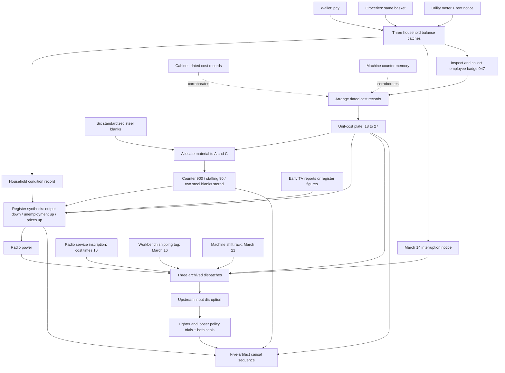
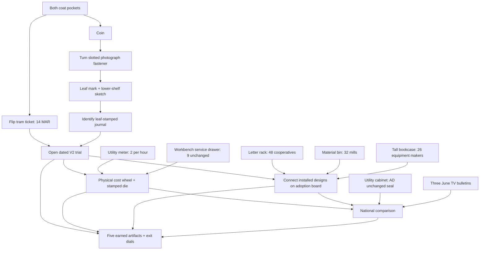

# Signal House — The Broken Signal: search, puzzle, and economic graphs

This revision preserves the illustrated continuous house, five camera positions, invisible accessible hotspots, nested close-ups, tactile controls, three-level hints, local saves, and two economic reveals. Exploration order is not the order of the economic events.

## Search graph: broad, available immediately

All five camera positions can be visited from the beginning. The household, workbench, TV, register, radio, and exit can be examined before their mechanisms can be completed. Inside objects, normal search steps still matter: move groceries, open the pay drawer, read the counter, pull a book, inspect a shipping tag. Optional outlines and keyboard focus expose the same targets without permanent labels.

Useful unresolved discoveries include pay before the ledger, machine memory before the cost rails, TV reports before national synthesis, and the radio tuning inscription before power. Household and workshop clues can accumulate in any order. Completing the cost rails requires employee badge 047 from the household drawer.

## Mission 1 puzzle graph: badge access and evidence convergence

### Household

Read the pay envelopes, both separate same-basket grocery receipts, utility account lying on the writing desk, and rent notice. The writing desk's lower drawer is the only entry to the household notebook and balance catches; the bookshelf is an atmospheric inspection. The notebook summarizes March/April pay ($3,000/$3,200), essentials ($2,200/$2,800), and remainder ($800/$400). Rotate three balance catches: pay UP, essentials UP, remainder DOWN. Release the drawer. There is no eight-slip clerical entry. The register supplies no national figures: all three television bulletins must be discovered before the indicator mechanism can be completed.

The illustrated drawer contains household evidence, the March 14 interruption notice, and employee badge 047. Inspect each item separately, then choose “Place in satchel”. Closing a preview does not collect it; uncollected items remain through reloads. The badge must be inserted to release the workbench cost rails. Earlier saves retain all previously collected rewards and completed workshop puzzles.

### Workshop

Click the machine counter or the separate time-card rack directly from the wide workshop view. The counter compares regular, committed, and revised production; the rack shows 120 workers falling to 90, with three groups of ten removed. Insert badge 047 and place the dated cost records in chronological order: March 12, March 16, March 21. Each movable record includes its date, input cost, other cost, and production total. A correct arrangement succeeds without extra visits to hidden source displays. The tray holds one March 16 shipping tag needed later; opening it records the date automatically.

Keep the existing scarce-input allocation: six steel blanks, two per job; A adds $80 for $54, B $48 for $54, C $72 for $54. Allocate A and C only. The released mechanism visibly shows production 1,200 → 900, staffing 120 → 90, and two steel blanks returned. The input bin also retains only two steel blanks afterward. The nearby shift rack supplies March 21 independently of the household.

### Register, radio, and policy

Opening the radio service flap reveals one readable service card and immediately records its clue. The card combines the tuning formula, the three date-source locations, and the power requirement; there is no second inscription click. Viewing the filing tray likewise records its visible shipping date. Register direction changes update the needle in place without rebuilding or animating connected records.

The register is physically accessible early. Its three record sockets require completed household, cost, and work-order evidence. Either all TV bulletins or the matched register figures supply national observations. The correct dials remain output DOWN, unemployment UP, prices UP. Solving supplies radio power.

Radio completion requires the household-derived date, the workshop cost/frequency, the service inscription, shipping date, shift-rack date, and synthesis power. Tune 270 kHz and keep March 14, March 16, March 21 dispatches in that order. Their reporting is retrospective: the disruption happened first; the reports did not cause or predict the factory changes.

The policy machine remains a two-direction experiment with competing objectives, not a recommendation quiz. Try tighter and looser demand settings and seat both objective seals. Neither setting repairs the supply network.

## Mission 1 economic causal graph

Input disruption → higher production costs → production/employment cuts → national output down, unemployment and prices up → inflation/employment policy tradeoff. The reveal identifies SRAS shifting left with AD initially unchanged.

The permanent evidence folder and exit use **five** artifacts: disruption, cost plate, shift board, national plate, policy record. The household record, date, and individual observations appear separately under supporting clues, not as extra final-sequence pieces. Internal legacy evidence IDs are retained for save compatibility.

## Mission 2 puzzle graph

## Mission 2 economic causal graph

Resource-saving trial → lower production costs → widespread adoption → SRAS right → real output rises and price level falls. AD unchanged is a required separate condition. The local trial is not treated as proof of aggregate change. See MISSION_2.md for all seven mechanisms.

## Hints and saved state

First-case hints prefer an unfinished mechanism in the current area, then a solvable branch with the most collected clues. They do not route every player back through the household. Second-case hints choose an available action in the current area; otherwise they identify missing dependencies. Each has three levels, culminating in explicit actions and locations.

The root save key/version remain `mastery-quests.shock-house.v1` / 1. `branchRevision:2` identifies new first-case progress; `householdPattern` adds three catches while old amount arrays remain readable. Mission 2 uses its own version 2. See README for migration and regression coverage.
