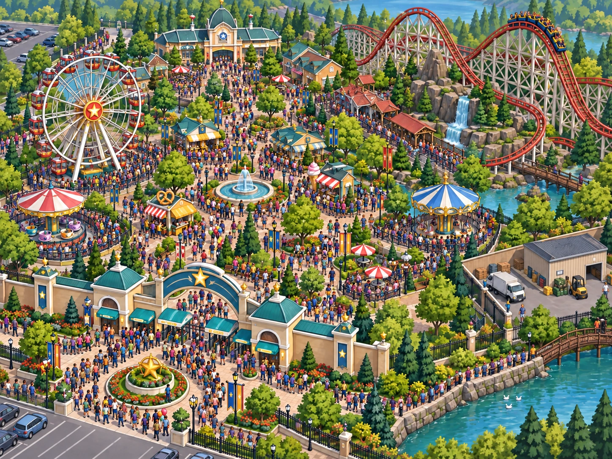
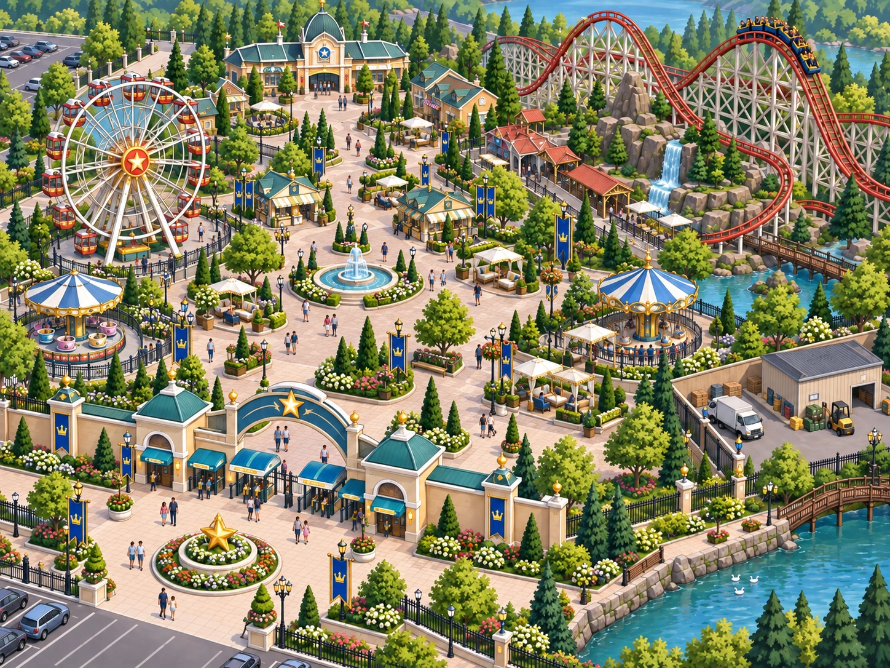

# The Main Attraction

*A park-management game built around pricing, capacity, and market power.*

Faculty Resource Guide · Mastery Quests

## Why This Game Exists

This was the first game where I began to think, “What kind of games do students want or like to play that I can hide the economics in?” That led me to mobile games. You make a choice, watch something change, then deal with what comes next. I wanted to try that kind of game.

RollerCoaster Tycoon was another influence. Some students might recognize that sort of park-management game or have fond memories of it. I wasn’t trying to recreate it. I wanted to see how much of that feeling I could get into a simpler learning game without all the animation and development work.

Once I settled on an amusement park, monopoly and price discrimination were easy to build around. The park has to set prices, manage queues, and decide which customers to reach. Repairs and new rides compete for funds, and other places are trying to attract the same families. I wanted students to run the park first. Then the economics could help them make sense of what they’d just done.

## What Students Do

Students take the role General manager · Starhaven Park. A run takes about 5–10 minutes, with six decisions spanning a season and the following season’s bookings. Starhaven is the dominant large-scale regional attraction, but families can choose festivals, smaller attractions, travel, or a day at home.

Students first choose whether to raise, hold, or lower admission. Lower prices bring a busy midway; higher or unchanged prices leave more room between the rides. They then manage busy periods through reservations, paid priority access, or open walk-up admission. Midsummer brings a choice among one admission price, peak/off-peak tickets, and off-peak memberships for local residents.

Later, the signature coaster needs attention. Students choose a full overhaul, inspected deferral, or partial repairs before deciding whether to build an attraction, improve throughput, or retain funds. A financed rival then prompts a response: lower-priced packages, a stronger premium experience, or existing prices and services. Earlier commitments affect what remains affordable, and repairs and construction carry consequences into the following season.

Five indicators track Park earnings, Guest access, Guest experience, Park capacity, and Market power. Earnings describes funds left after operating and investment decisions; access includes both admission affordability and practical use of rides. These bounded 0–8 ordinal conditions form an instructional model, not accounting profit, attendance totals, dollars, percentages, or a welfare index. The scenario estimates neither demand elasticities nor an optimal price. Read the conditions separately, using the consequences to explain tradeoffs; adding them creates no meaningful total score.

## What the Game Is Really Teaching

Students see what Starhaven’s market power allows as soon as they choose an admission price. A higher price sends some families elsewhere; a lower price brings more through the gates. Managers face downward-sloping demand. The scenario assumes relatively inelastic demand over its opening range: the higher price more than offsets lost sales, raising earnings. A price cut brings too few extra sales to offset the discount, and extra operating shifts cost money. With elastic demand, raising price would instead reduce revenue.

To sell more admissions at one uniform price, the park generally must lower the price for existing buyers as well as new visitors. Revenue gained on extra sales is partly offset by revenue lost on existing sales. That is why marginal revenue lies below price in the single-price model. Ask about the added revenue and operating cost of another admission. Past spending on existing rides is sunk; it does not determine that marginal cost.

Once more families are inside, the rides still have the same number of seats. Reservations protect the experience of those admitted by excluding some willing customers and reducing ticket earnings. Open walk-up admission reaches more guests, whose extra receipts cover the added operating costs in this scenario. Yet those visitors also lengthen other people’s waits. In the busy branch, heavy use even takes equipment out of rotation. A profitable extra admission can leave people already inside with fewer rides to enjoy.

With paid priority, guests decide how much avoiding a wait is worth to them. Some guests buy faster access, while ordinary-ticket visitors receive a smaller share of the busiest ride slots. The park earns more from the same rides. This introduces price discrimination through different waiting times. Ask who gains time and who carries the remaining wait.

By midsummer, managers are deciding whether different visitors should pay different admission prices. Flexible visitors can use cheaper off-peak dates, while families tied to busy dates pay more. Dated tickets help prevent resale and shift some attendance away from peak queues. This combines differences in price sensitivity with congestion across time. Named local memberships separate an eligible group and limit resale through personal and date restrictions. After a higher opening price, those passes bring price-sensitive residents back and raise earnings; on other paths, some discounts replace full-price sales, with earnings unchanged. Repeat visits also add waiting. Market power, different willingness to pay, workable separation, and limits on resale support these strategies. A discount’s success depends on whom it reaches and what those guests would otherwise have bought.

By late summer, the engineers’ repair decision competes with plans for expansion. A full overhaul uses funds and removes current ride capacity, then restores service and reduces interruptions the following season. Deferral keeps the coaster operating under inspection but brings later closures and patching costs; partial repairs improve today’s visit while leaving major work due. Earlier heavy use makes deferral more disruptive. Building a new attraction cannot repair the old one, so investment can coexist with deteriorating service elsewhere in the park.

A new attraction raises another question about timing: the park has to pay for it before anyone can ride it. Loading improvements cost less and deliver some extra throughput sooner, with further gains next season. Retaining funds preserves flexibility but leaves existing rides to do the work of attracting guests. The choice concerns both capacity and differentiation, with today’s spending limiting other uses of the money.

As the rival secures financing, families gain more alternatives and become more price-sensitive. Starhaven can broaden access through price concessions or pay for distinctive entertainment and service that some guests will value. Keeping its offer unchanged saves funds while pricing power erodes further. Scarce riverside land, established rides, reputation, and large fixed investment still make entry difficult. Competition can therefore weaken market power without eliminating it. Across the season, stronger earnings, broader access, and a better visit need not move together; managers must explain the priorities behind their choices.

## Reading the Changing Park

Students keep returning to the same park, where their earlier choices have changed what they need to deal with next. Compare the crowded midway with the lower-volume premium scene. Which families can get in, and how much ride time do admitted guests receive?

*Crowded midway, left, and premium operation, right. Admission access and the experience inside the park can move in different directions.*

Elsewhere, worn facilities make deferred upkeep visible, and construction becomes an expanded park after the attraction opens. These scenes give consequences a physical setting. Use the decision history to explain them; counting illustrated guests or rides supplies no quantitative evidence.

## The Educational Loop

Choices produce visible consequences and explanations. At the ending, What changed overall and Your path connect the headline to all six decisions. Five unranked endings highlight different conditions; none establishes a universally best strategy. The four-part economics explanation brings together pricing and marginal reasoning, customer segmentation, ride time and investment, and competition. Try the next attraction then offers two applications: a different park’s price-cut calculation and a museum’s resale problem. Explanations and retries support completion. Replay and the optional monopoly graph extend that reasoning.

**Experience → Consequence → Economic Explanation → Formalization → Transfer**

## Bringing in the Monopoly Model

The game includes the two applications above, but no monopoly graph. This is a faculty extension. Start with uniform admission pricing and set aside segmentation and congestion spillovers while introducing the standard model.

1. Ask what gives Starhaven market power. Put admission price and cost vertically and admissions horizontally; draw downward-sloping demand.
2. Explain why a lower uniform price applies to existing buyers as well as additional guests. Draw marginal revenue below demand.
3. Add marginal cost for serving guests. Keep past spending on existing rides separate from that additional operating cost.
4. Locate the profit-maximizing quantity where MR = MC in the standard interior case, with MC crossing MR from below.
5. Read the corresponding admission price from demand at that quantity. Management chooses a price–quantity combination constrained by demand.
6. If appropriate for the course, compare with the larger quantity where price equals MC, the allocatively efficient benchmark when external costs are absent.
7. Return to the park. Identify decisions affecting price, access, capacity, or customer separation. Discuss how waiting costs complicate the efficiency comparison.

Keep the sketch schematic; Guest access, Guest experience, and Market power supply no numerical coordinates. For the built-in park calculation, compare total revenue before and after the price cut, including the lower price on existing sales, then subtract the extra operating cost. Its hypothetical dollar amounts belong to that separate application.

## Using It in Class

These are possible starting points; choose what fits your course.

### Before formal monopoly instruction

Let students manage Starhaven first. Ask why they could choose among admission prices and why families could still decline to buy. Their accounts introduce market power and downward-sloping demand before the diagram.

### During monopoly instruction

Connect admission price to quantity demanded and revenue. Use the single-price decision and closing park calculation to explain MR below price, then add costs through the graph procedure above.

### Price-discrimination instruction

Compare priority access, dated tickets, and local memberships. What separates customers? What prevents resale? Which discounted visitors are additional, and which would have paid full price? The museum application tests how easy resale weakens that separation.

### After instruction

Ask students to identify a pricing, segmentation, capacity, and investment decision, plus an event affecting market power. Read the ending alongside the five conditions and accumulated consequences. Similar headlines can conceal different management histories.

### Replay and comparison

Record the first path, change the opening price, and predict the next queue problem before using Replay scenario. Alternatively, hold pricing similar while changing segmentation. Compare all five conditions and account for any later funding constraints. Treat this as a management comparison, without searching for a hidden optimal route.

### Independent/student review

Students can complete the simulation, economics explanation, and applications independently. Request an ending screenshot and a short explanation linking a decision to monopoly or price discrimination through your course workflow. The game provides no automatic faculty report.

## Questions to Consider

Select any of these prompts for discussion or a short reflection.

1. What gives Starhaven market power, and what keeps that power from being unlimited?
2. Why does raising admission increase earnings in the opening scenario despite fewer visits? What demand condition could reverse the revenue result?
3. How can another admission benefit the park while making the visit worse for guests already inside?
4. Why does paid priority earn more without increasing ride capacity? Who gains time, and who waits longer?
5. How do dated tickets and named memberships help separate customers? What would easy resale change?
6. When does a membership attract additional business, and when does it replace a full-price sale? Use the opening price to explain the difference.
7. Compare overhaul, throughput work, and a new attraction. When do their costs and capacity effects arrive, and what remains unresolved?
8. How does a financed competitor affect Starhaven before opening? Why can substantial market power remain?

## Common Misconceptions

- “A monopolist can charge any price without losing customers.” Families can choose substitutes; Starhaven faces downward-sloping demand.
- “Higher prices always increase monopoly earnings.” The opening assumes relatively inelastic demand. With elastic demand, a price increase reduces revenue; costs also matter for earnings.
- “More admissions are always better.” Extra receipts can exceed operating costs while congestion worsens the experience of other guests.
- “Paid priority creates more ride capacity.” It sells different access to the same seats, changing who waits and for how long.
- “Any discount is successful price discrimination.” Resale can undermine customer separation, and discounts may replace full-price purchases. Ask what additional business the offer creates.
- “A new attraction adds capacity as soon as construction starts.” Funds leave before the ride opens. Expansion also leaves any deferred repairs on the old coaster unresolved.

General teaching and implementation resources are available at [Mastery Quests Faculty Resources](https://masteryquests.org/how-to/).
