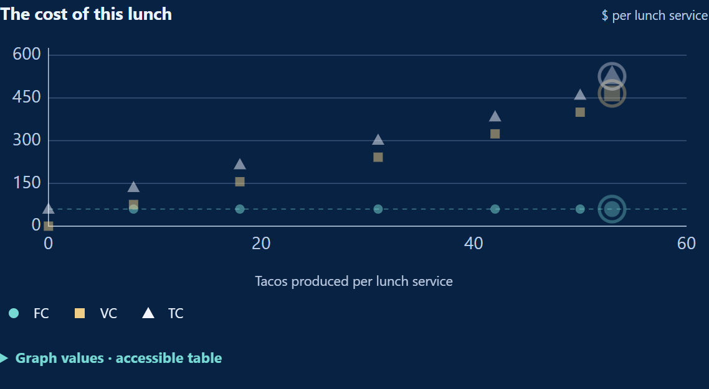

# Takeout Taco: The Cost of Lunch

*A food-truck game connecting staffing, output, and the cost of serving lunch.*

Let students manage the truck first, then use their decisions and cost record to explain short-run costs. The game works independently or as a follow-up to Takeout Taco: Lunch Rush.

## Why This Game Exists

Takeout Taco: The Cost of Lunch was a relatively simple concept. I really just needed to expand Lunch Rush and show the rest of the production and cost loop. I wanted to keep the standard cost curves from driving the experience and have students focus on managing a lunch rush and seeing how their decisions change costs.

The graph is in the game, but mostly as a reference. Students manage the truck, watch the numbers change, and then the economics at the end brings everything together. By then, the curves have something to explain.

That made this a natural follow-up to Lunch Rush. Students who have played it already know what happens as more workers enter a fixed space. Here, they see what those production decisions do to costs. Both games use the same crew-capacity schedule and truck artwork, but this one also limits actual production by the order students are trying to fill.

## What Students Do

Students make decisions through eight rounds. They first open the shutters or wait, with equipment already committed and no tacos produced. Orders then grow from 8 to 18, 31, 42, 50, and 53 tacos. Students keep their crew or hire up to the newly offered size. They can continue with unfilled orders, including a path that never hires anyone.

Each completed service reports tacos made against tacos promised, total cost per lunch, and an explanation. Ingredients automatically match actual production. FC, VC, and TC appear on the result graph; Cost Report and View Cost Curves offer detail. “Explore Another Choice” lets students test a different crew at the same order, sometimes including extra staffing. All experiments remain recorded; the final review uses the last choice in each round.

The eighth round asks students to promise 40, 62, or 80 tacos, then keep one truck with their previous crew or add a truck and grill. Expansion schedules six workers and asks how to divide them. Choosing the order and equipment does not itself produce tacos; the completed service records the result.

The closing review brings together the eight decisions, cost explanations, calculated alternatives, and a bakery example. An optional Cost Lab then lets students vary orders, staffing, trucks, worker allocation, and grill availability without changing their story record.

## What the Game Is Really Teaching

The first bill arrives before the first taco. One truck costs $1,000 per month and its grill $200. Spread over the model’s 20 identical services, that is $60 per lunch in fixed cost. Opening or waiting does not erase the obligation. These costs stay fixed as output changes within that equipment configuration.

Hiring adds $60 per worker per service, and each completed taco requires a $2 ingredient kit. Those are the variable costs. Labor expense depends on the crew scheduled, even if orders or equipment leave workers idle; ingredients in normal play match completed output. With one worker making 8 tacos, wages are $60 and ingredients $16. Variable cost is $76, and total cost is $60 + $76 = $136. The report also shows monthly equivalents. Successive trials are alternative operating plans, not bills to add into a season total.

The shared production schedule gives 0, 8, 18, 31, 42, 50, and 53 tacos of capacity with zero through six workers in one equipped truck. The first three workers add 8, 10, and 13 tacos as tasks become easier to divide. The fourth adds 11, the fifth 8, and the sixth 3. Diminishing marginal product begins with Worker 4, while total capacity continues rising.

At full capacity, an additional worker costs $60 plus $2 for each extra taco. The third worker’s 13-taco increment costs $86, or about $6.62 per extra taco. The sixth worker adds only 3 tacos for $66, or $22 each. With equipment fixed, the staffing reference is MC = change in total cost / change in output. Here it equals $60 divided by the worker’s marginal product, plus the $2 ingredient cost. Specialization lowers that incremental cost; crowding raises it.

Actual orders matter too. Moving from two to three workers for a 20-taco order raises production from 18 to 20, not to the third worker’s capacity of 31. That decision adds $64 for two tacos, or $32 each. The full-capacity staffing reference remains $6.62. Conversely, another taco made with already staffed idle capacity adds only its $2 ingredient kit. The game distinguishes these actual-plan comparisons from its calculated staffing MC.

The averages spread a bill across actual output. AFC divides fixed cost by tacos made; AVC divides wages and ingredients by that output; ATC divides total cost. At 8 tacos, the $60 fixed bill contributes $7.50 per taco. At 50 tacos it contributes $1.20, although the bill remains $60. At any positive output, ATC − AVC = AFC. Productivity and paid idle labor also affect the variable and total averages. At zero output, all three averages are undefined. For a comparable output increment, marginal cost below an average pulls that average down; marginal cost above it pushes the average up.

Adding a second equipped truck raises fixed cost to $120 per lunch and starts a different short-run cost relationship. Six workers split 3 + 3 can make 62 tacos, compared with 53 together in one truck. The added space can make a larger commitment feasible, but the 80-taco promise exceeds every six-worker story allocation. Expansion is a capital-planning comparison, not a short-run MC observation. The game compares feasibility and cost; it supplies no selling price or profit calculation that could establish a universally best plan.

## Reading the Cost Graph

The graph supports the management decision. It first appears after a completed service and adds FC, VC, and TC observations throughout play. On phones, students can expand it with “See the new graph point.” Horizontal position shows tacos per lunch; vertical position shows dollars per lunch.

This example hires through six workers and reaches 53 tacos. FC stays at $60; the final VC is $466 and TC is $526. Other choices produce different observations. The rings identify the latest trial.

View Cost Curves offers AFC, AVC, ATC, and MC in dollars per taco. Solid markers show actual decisions; dashed references identify calculations. Staffing MC is introduced as the relevant rounds explain it. Untested full reference schedules unlock after completion. Repeated identical observations share a marker, but the accessible tables and Cost Report retain every trial.

Keep equipment configurations separate. Expansion adds a second main graph with matching scales; no line joins the two operations. The optional view also separates equipment and can compare actual costs with the minimum for that output and equipment. Workers and tacos are discrete, so these are not smooth textbook curves. Use the marginal-versus-average reasoning to explain changes, without claiming that the displayed MC segments cross AVC and ATC exactly at their minima.

## The Educational Loop

“What happened?” reviews the student’s final choices. “Why did it happen economically?” connects fixed and variable bills, capacity, marginal cost, averages, and capital. “Where else does this apply?” works through a bakery’s oven, labor, ingredients, and a 40-loaf promise. It is a worked transfer example; students do not submit a graded bakery answer. The optional Cost Lab supplies hands-on application to new operating plans.

**Experience → Consequence → Economic Explanation → Formalization → Transfer**

The familiar green truck makes specialization and crowding visible. Captions specify actual staffing and allocation; artwork is illustrative. The production and cost values are simplified instructional examples, not empirical estimates of food-truck costs.

## Using It in Class

### Connecting production and cost

After Lunch Rush, ask why later workers added less output, then trace what that does to incremental cost. If students begin here, the crew descriptions and closing schedule supply the production story. Let them manage before explaining every curve.

### Working with actual decisions

Compare a fulfilled order with a trial using idle labor. Ask what changed in output, wages, ingredients, and cost per extra taco. Use the graph and report to distinguish the actual decision from the full-capacity reference. For average costs, compare the fixed bill with its cost per taco as output grows.

### Review, transfer, and replay

Pause before revealing the bakery solution and ask students to justify a feasible crew and its cost. In the Cost Lab, vary one feature at a time; its history, report, and export stay separate from the story. Replay uses the same economics with different choices, not randomized conditions. Earlier runs remain reviewable in the open tab after another completion. Reloading starts a new run; locally recorded anonymous events do not restore progress. Students can download trial data from the Cost Report for instructor-directed submission.

## Questions to Consider

1. Why does the opening cost $60 even with no production? What changes after hiring?
2. Which costs change when a paid crew uses idle capacity to make another taco?
3. Why does the third worker’s full-capacity increment cost less per taco than the sixth worker’s?
4. How can hiring the third worker cost $32 per extra taco for a 20-taco order?
5. Why can AFC fall while fixed cost stays unchanged? What does ATC − AVC measure?
6. What happened in the truck to produce a particular point on your graph?
7. Why must adding another truck be separated from the one-truck MC comparison?
8. How would you test a cheaper feasible plan in the Cost Lab without changing several things at once?

## Common Misconceptions

- “Fixed cost falls as output rises.” Fixed cost stays unchanged within the equipment setup; fixed cost per taco falls.
- “Diminishing returns means output falls.” Later workers add fewer tacos here, but their additions remain positive.
- “Every cost difference is MC.” Actual plans may change equipment, leave labor idle, or face limited orders. The staffing reference uses comparable full-capacity increments.
- “An extra worker always adds their full marginal product.” Capacity may rise beyond the order; actual production stops at that order.
- “The cheapest trial must meet the goal.” A low-cost plan can leave orders unfilled. Compare feasibility before costs across plans.
- “The curves must have smooth textbook minima.” The game uses discrete staffing and whole tacos. Its calculated references are distinct from observed trials.
