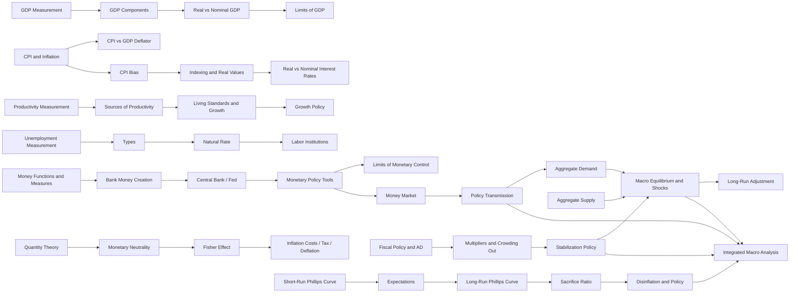

# Macro Family Sequence Map

This is a dependency map, not a mandatory textbook order. Multiple entry points are valid; arrows identify high-value Bridge directions.

## Cross-family joins

- Real/nominal GDP and CPI/deflator jointly support real-value interpretation.
- Real interest links Inflation Measurement to Fisher and money-market transmission.
- Unemployment/natural rate links Labor to Phillips curves and long-run adjustment.
- Monetary tools link Fed Operations to Money Market/Transmission.
- AD-AS links monetary and fiscal policy to equilibrium, shocks, and Phillips outcomes.
- Integrated Macro Analysis should sit after at least two of AD-AS, transmission, fiscal stabilization, or Phillips/disinflation are active.

Future Bridge questions should name or metadata-tag both source and destination skill, make the connection itself the task, and route back to a synthesis retest.
